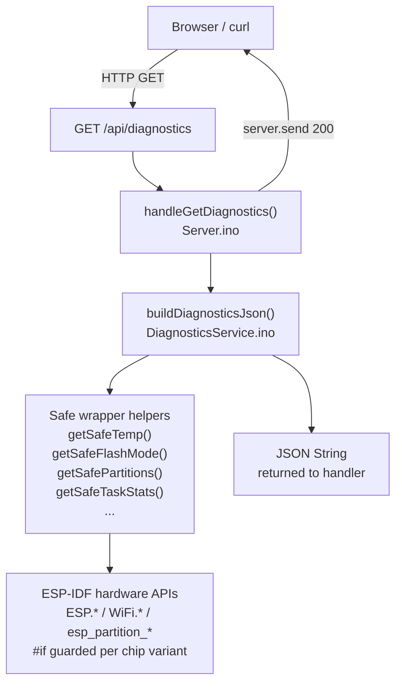

# Iteration 10: Diagnostics REST API — `GET /api/diagnostics`

## Goal

Expose the full hardware diagnostics dataset from `Diagnostics/Diagnostics.ino` as a
REST API endpoint `GET /api/diagnostics` that:

- Returns a comprehensive JSON document covering every data point the existing
  `Diagnostics.ino` prints over serial — chip, memory, flash, PSRAM, partitions, temperature,
  WiFi, MAC addresses, SDK version, and task health.
- Is **always safe to call** regardless of ESP32 chip variant, SDK version, or whether an
  optional hardware feature (PSRAM, temperature sensor) is present — using compile-time
  `#if` guards and safe fallback values in place of try-catch (C++ has no try-catch for
  hardware API failures).
- Lives entirely in a new `DiagnosticsService.ino` that follows the same separation-of-concerns
  pattern as `HtmlService.ino` — `Server.ino` calls one function and sends the result.
- Replaces the existing `/status` endpoint (which covers a small overlapping subset) so there
  is one canonical diagnostics endpoint.

This iteration does **not** change `DeviceState`, `ModBus`, or the threading model.

---

## Background & Design Decisions

### Why a separate `DiagnosticsService.ino`

The same rationale that led to `HtmlService.ino` applies here: `Server.ino` owns routing
only. All data-collection logic is isolated in `DiagnosticsService.ino`. This keeps
`Server.ino` short and makes the diagnostics data independently testable.

### The C++ equivalent of try-catch for hardware API calls

C++ on the ESP32 does not have exceptions for hardware API failures — a call that is not
supported on a particular chip variant will simply not compile, or may return a garbage value
at runtime. The defensive patterns used in this iteration are:

| Risk | Defence used |
|---|---|
| API does not exist on this chip variant | `#if defined(CONFIG_IDF_TARGET_ESP32)` compile-time guard — same as `Diagnostics.ino` line 157 |
| Function returns `0` or `-1` when unavailable | Wrapper function returns a sentinel string `"N/A"` or numeric `-1` |
| `esp_partition_find` iterator leak | Iterator always released in `esp_partition_iterator_release()` even if loop exits early |
| `ESP.getChipModel()` returns `NULL` on older SDKs | Null-check before `String()` construction — fall back to `"Unknown"` |
| `temperatureRead()` not declared | `#ifdef CONFIG_IDF_TARGET_ESP32` guard — identical to `Diagnostics.ino` |
| WiFi not connected when called | Check `WiFi.status() == WL_CONNECTED` before reading IP, RSSI, subnet, gateway |
| Integer overflow in flash size calculation | Use `uint32_t` arithmetic with bounds check before division |

These guards are applied in `DiagnosticsService.ino` wrapper helpers, not scattered across the
JSON-building code. Each wrapper returns a safe value; the JSON builder never needs to know
about chip compatibility.

### What `/status` currently covers vs. what `/api/diagnostics` adds

The existing `handleGetStatus()` in `Server.ino` is a subset of the new endpoint:

| Field group | `/status` (current) | `/api/diagnostics` (new) |
|---|---|---|
| Chip model, revision, cores, CPU freq, reset reason | ✓ | ✓ |
| Heap size, free heap, min free heap | ✓ | ✓ |
| Flash size | partial (MB only) | full: size, speed, mode |
| PSRAM | size only | size + free + found flag |
| Max alloc heap | ✗ | ✓ |
| Sketch size + free sketch space | ✗ | ✓ |
| Partition table | ✗ | ✓ array |
| Internal temperature | ✗ | ✓ guarded |
| Cycle count | ✗ | ✓ |
| SDK version | ✗ | ✓ |
| Efuse MAC | ✗ | ✓ |
| WiFi: IP, RSSI, MAC, SSID | ✓ | ✓ |
| WiFi: subnet mask, gateway, AP MAC | ✗ | ✓ |
| FreeRTOS task list: name, core, stack HWM | ✗ | ✓ |
| Build date/time | ✗ | ✓ |

`GET /status` is removed and replaced by `GET /api/diagnostics`. Any existing client using
`/status` must update to `/api/diagnostics` — the data is a strict superset.

### FreeRTOS task health in the JSON

`uxTaskGetStackHighWaterMark(handle)` reports how many bytes of stack remain unused at the
watermark — the lowest value ever seen. A value approaching zero means the stack size constant
needs to be increased. Including this in the diagnostics endpoint means stack health can be
checked at any time via a simple HTTP GET without reading the serial monitor.

Both task handles (`g_taskWebHandle`, `g_taskModbusHandle`) are declared as globals in
`SerialController.ino` — `DiagnosticsService.ino` can reference them via `extern`.

### Architecture at the end of Iteration 10



---

## JSON Response Structure

```json
{
  "build": {
    "date": "Mar 22 2026",
    "time": "19:13:07"
  },
  "chip": {
    "model": "ESP32-D0WD-V3",
    "revision": 301,
    "cores": 2,
    "cpuFreqMHz": 240,
    "resetReason": "Deep Sleep Wakeup",
    "features": "WiFi BT BLE External-Flash",
    "cycleCount": 907603406,
    "sdkVersion": "v5.5.2-729-g87912cd291",
    "efuseMac": "046059F924F0",
    "temperatureC": 48.3
  },
  "memory": {
    "heapSize": 332912,
    "freeHeap": 235048,
    "minFreeHeap": 231472,
    "maxAllocHeap": 110580,
    "psramFound": false,
    "psramSize": 0,
    "psramFree": 0
  },
  "flash": {
    "sizeMB": 4,
    "speedMHz": 80,
    "mode": "QIO"
  },
  "sketch": {
    "sizeBytes": 908528,
    "freeBytes": 1310720
  },
  "partitions": [
    { "label": "nvs",      "type": "Data", "address": "0x009000", "sizeKB": 20 },
    { "label": "app0",     "type": "App",  "address": "0x010000", "sizeKB": 1280 }
  ],
  "wifi": {
    "connected": true,
    "ssid": "MyNetwork",
    "ip": "192.168.1.149",
    "subnetMask": "255.255.255.0",
    "gateway": "192.168.1.1",
    "rssi": -65,
    "staMac": "F0:24:F9:59:60:04",
    "apMac": "00:00:00:00:00:00"
  },
  "tasks": [
    { "name": "WebServer_Task", "core": 0, "stackHwmBytes": 4200 },
    { "name": "Modbus_Task",    "core": 1, "stackHwmBytes": 3800 }
  ]
}
```

> Fields that are unavailable on the current chip variant are present with value `"N/A"` (strings)
> or `-1` (numbers) — the key is always present so callers never need to check for missing keys.

---

## Files Changed

| File | Action | Purpose |
|---|---|---|
| `SerialController/DiagnosticsService.ino` | **New** | All diagnostic data collection, safe wrapper helpers, `buildDiagnosticsJson()` |
| `SerialController/Server.ino` | **Edit** | Add `handleGetDiagnostics()`; register `GET /api/diagnostics`; remove old `handleGetStatus()` and its route; update startup route log |
| `SerialController/SerialController.ino` | **No change** | Task handles already declared as globals — `extern` reference from `DiagnosticsService.ino` is sufficient |
| `SerialController/ModBus.ino` | **No change** | Untouched |
| `SerialController/DeviceState.h` | **No change** | Untouched |
| `SerialController/HtmlService.ino` | **No change** | Untouched |
| `SerialController/SerialStdout.ino` | **No change** | Untouched |

---

## Sub-Tasks

---

### Sub-Task 10.1 — Create `DiagnosticsService.ino` with safe wrapper helpers

**Intent:** Build all the individual data-collection wrappers first, in isolation, before
assembling them into JSON. Each wrapper encapsulates exactly one compatibility risk. This
makes each guard reviewable and testable independently.

**Expected Outcomes:**
- `DiagnosticsService.ino` compiles on any ESP32 variant without errors or warnings.
- Every wrapper returns a meaningful safe value when the underlying API is unavailable —
  never an uninitialised variable.
- No raw `ESP.*`, `WiFi.*`, or `esp_partition_*` calls appear outside these wrappers in
  the JSON-building code.

**Todo List:**
1. Create `SerialController/DiagnosticsService.ino`.
2. Add includes: `Arduino.h`, `WiFi.h`, `esp_system.h`, `esp_chip_info.h`,
   `esp_partition.h`, `esp_ota_ops.h`.
3. Add `extern TaskHandle_t g_taskWebHandle;` and `extern TaskHandle_t g_taskModbusHandle;`
   so task stack watermarks can be read.
4. Implement the following wrapper functions. Each uses `#if` guards and null/range checks:

   - `String diagGetChipModel()` — returns `ESP.getChipModel()` if non-null, else `"Unknown"`.
   - `String diagGetResetReason()` — delegates to the existing `getResetReasonString()`
     already declared in `Server.ino` (same translation unit); no duplication needed.
   - `String diagGetFeatures()` — calls `esp_chip_info()`, builds a space-separated string
     of feature flags using the same `CHIP_FEATURE_*` bitmask checks as `Diagnostics.ino`
     lines 117–122; returns `"N/A"` if `esp_chip_info` fails.
   - `float diagGetTemperature()` — returns `temperatureRead()` inside
     `#if defined(CONFIG_IDF_TARGET_ESP32) || defined(CONFIG_IDF_TARGET_ESP32S2) || defined(CONFIG_IDF_TARGET_ESP32S3) || defined(CONFIG_IDF_TARGET_ESP32C3)`;
     returns `-1.0` on all other variants.
   - `String diagGetFlashMode()` — delegates to the existing `getFlashModeString()`
     declared in `Server.ino`; returns `"N/A"` if mode value is out of range.
   - `bool diagIsPsramFound()` — returns `psramFound()`.
   - `String diagGetPartitionsJson()` — iterates the partition table using
     `esp_partition_find` / `esp_partition_get` / `esp_partition_next`, builds a JSON
     array string, **always** calls `esp_partition_iterator_release(it)` before returning,
     even if the iterator is NULL.
   - `String diagGetTaskStatsJson()` — reads `uxTaskGetStackHighWaterMark` for
     `g_taskWebHandle` and `g_taskModbusHandle`; returns a two-element JSON array;
     if a handle is NULL (task not yet started), uses `0` for the watermark and `"unknown"`
     for the name.
   - `String diagGetWifiJson()` — checks `WiFi.status() == WL_CONNECTED` before reading
     IP, subnet, gateway, RSSI; uses `"N/A"` / `0` for fields that require a live connection.

**Relevant Context:** `Diagnostics/Diagnostics.ino` lines 108–177 for all the data-collection
calls and their existing `#if` guards; `Server.ino` `getResetReasonString()` (line 27) and
`getFlashModeString()` (implicitly — check if it exists there or needs adding).

**Status:** `[ ] pending`

---

### Sub-Task 10.2 — Implement `buildDiagnosticsJson()`

**Intent:** Assemble all wrapper results into the JSON document defined above. This function
contains no hardware API calls — it only calls the wrappers from Sub-Task 10.1 and does
string concatenation. Keeping data collection and serialisation separate makes both halves
simpler.

**Expected Outcomes:**
- `buildDiagnosticsJson()` returns a valid, complete JSON `String` matching the structure
  defined in the JSON Response Structure section above.
- All float values use 1 decimal place (`String(val, 1)`).
- All integer values are serialised without quotes.
- String values that may contain special characters (SSID, chip model) are not escaped beyond
  what is already safe — SSID and model strings from the ESP SDK never contain `"` or `\`.
- The function is callable from any core (it does not touch `Serial2` or `server`).

**Todo List:**
1. Add `String buildDiagnosticsJson()` to `DiagnosticsService.ino`.
2. Open the JSON root `{` and build each named section by calling the wrappers:
   - `"build"` — `__DATE__` and `__TIME__` compiler macros, wrapped in `String(...)`.
   - `"chip"` — `diagGetChipModel()`, `ESP.getChipRevision()`, `esp_chip_info.cores`,
     `ESP.getCpuFreqMHz()`, `diagGetResetReason()`, `diagGetFeatures()`,
     `ESP.getCycleCount()`, `ESP.getSdkVersion()`, efuse MAC formatted as hex string,
     `diagGetTemperature()`.
   - `"memory"` — `ESP.getHeapSize()`, `ESP.getFreeHeap()`, `ESP.getMinFreeHeap()`,
     `ESP.getMaxAllocHeap()`, `diagIsPsramFound()`, `ESP.getPsramSize()`,
     `ESP.getFreePsram()`.
   - `"flash"` — `ESP.getFlashChipSize() / (1024*1024)`, `ESP.getFlashChipSpeed() / 1000000`,
     `diagGetFlashMode()`.
   - `"sketch"` — `ESP.getSketchSize()`, `ESP.getFreeSketchSpace()`.
   - `"partitions"` — inline `diagGetPartitionsJson()`.
   - `"wifi"` — inline `diagGetWifiJson()`.
   - `"tasks"` — inline `diagGetTaskStatsJson()`.
3. Close the JSON root `}` and return the String.

**Relevant Context:** Existing `handleGetStatus()` JSON-building pattern
([`Server.ino:90–113`](SerialController/Server.ino:90)); `Diagnostics/Diagnostics.md` for
the canonical field list and example values.

**Status:** `[ ] pending`

---

### Sub-Task 10.3 — Add `buildDiagnosticsPage()` to `DiagnosticsService.ino`

**Intent:** Add a human-readable HTML diagnostics page by reusing `htmlHeader()` and
`htmlFooter()` from `HtmlService.ino` and rendering the collected data as a structured table.
The page fetches `GET /api/diagnostics` via JavaScript on load and auto-refreshes every
10 seconds — so it always shows the current live values without a page reload.
10 seconds is appropriate here (diagnostics data changes slowly) and reduces ESP32 load
compared to the 2-second poll on the control panel.

**Expected Outcomes:**
- `GET /diagnostics` returns a complete HTML page with the same header/footer chrome as
  the control panel at `GET /`.
- The page renders all diagnostic sections (Chip, Memory, Flash, Sketch, Partitions, WiFi,
  Tasks) as labelled rows in a dark-themed table consistent with the existing CSS.
- Values are populated by a `fetch('/api/diagnostics')` call on load and every 10 seconds.
- Partition table is rendered as a sub-table (one row per partition).
- Tasks section shows name, core, and stack watermark for each task.
- The breadcrumb in the header shows `"Diagnostics"`.
- A link `← Control Panel` at the top of the body navigates back to `GET /`.
- No additional JavaScript libraries are required.

**Page layout (wireframe):**

```
┌─────────────────────────────────────────────┐
│  SerialController            Diagnostics    │  ← shared header / breadcrumb
├─────────────────────────────────────────────┤
│  ← Control Panel                           │
│                                             │
│  BUILD                                      │
│    Date       Mar 22 2026                   │
│    Time       19:13:07                      │
│                                             │
│  CHIP                                       │
│    Model      ESP32-D0WD-V3                 │
│    Cores      2                             │
│    CPU        240 MHz                       │
│    Temp       48.3 °C                       │
│    ...                                      │
│                                             │
│  MEMORY                                     │
│    Heap       332912 / 235048 free          │
│    ...                                      │
│                                             │
│  PARTITIONS                                 │
│  ┌─────────┬──────┬──────────┬────────┐    │
│  │ Label   │ Type │ Address  │ Size   │    │
│  │ nvs     │ Data │ 0x009000 │  20 KB │    │
│  │ app0    │ App  │ 0x010000 │1280 KB │    │
│  └─────────┴──────┴──────────┴────────┘    │
│                                             │
│  TASKS                                      │
│    WebServer_Task  Core 0   4200 B HWM      │
│    Modbus_Task     Core 1   3800 B HWM      │
│                                             │
│  Last updated: 19:13:42   [Refresh now]     │
├─────────────────────────────────────────────┤
│  © 2025 WarpGuru  github.com/Warpguru/ESP   │  ← shared footer
└─────────────────────────────────────────────┘
```

**Todo List:**
1. Add `String buildDiagnosticsPage()` to `DiagnosticsService.ino`.
2. Call `htmlHeader("Diagnostics", "Diagnostics")` to open the page with shared CSS and JS.
3. Emit a `<a href="/">← Control Panel</a>` navigation link before the first section.
4. Emit one `<section>` per JSON group (`BUILD`, `CHIP`, `MEMORY`, `FLASH`, `SKETCH`,
   `WIFI`, `TASKS`) as a `<table class="diag-table">` with two columns: label and value.
   - Use `id` attributes on each value cell so JavaScript can update them in place.
   - Partition table: render as a nested `<table>` inside the `PARTITIONS` value cell,
     with columns `Label`, `Type`, `Address`, `Size KB`; rows populated by JavaScript.
   - Tasks table: similarly a nested `<table>` with columns `Name`, `Core`, `HWM bytes`.
5. Add a status line at the bottom of the body: `Last updated: <span id="diagTime">--</span>`
   and a `[Refresh now]` button that calls `loadDiag()`.
6. Embed a small `<script>` block (page-specific, not shared with the header):
   - `function loadDiag()` — `fetch('/api/diagnostics')` → parse JSON → update each value
     cell by ID → rebuild the partitions and tasks nested tables → update `diagTime` with
     `new Date().toLocaleTimeString()`.
   - `window.addEventListener('load', function() { loadDiag(); setInterval(loadDiag, 10000); });`
7. Call `htmlFooter()` to close the page.

**Relevant Context:** [`htmlHeader()`](SerialController/HtmlService.ino) and
[`htmlFooter()`](SerialController/HtmlService.ino) from Sub-Task 8.3;
`buildDiagnosticsJson()` as the data source; `Diagnostics/Diagnostics.md` wireframe.

**Status:** `[ ] pending`

---

### Sub-Task 10.4 — Add routes to `Server.ino` and remove `/status`

**Intent:** Wire both the JSON API and the HTML page into the HTTP layer and remove the
now-superseded `/status` endpoint cleanly.

**Expected Outcomes:**
- `GET /api/diagnostics` returns HTTP 200 `application/json` with the full diagnostics JSON.
- `GET /diagnostics` returns HTTP 200 `text/html` with the diagnostics web page.
- `GET /status` no longer exists — its handler and route registration are deleted.
- The startup route log in `setup()` reflects the updated route list.
- Both handlers use `serialLog()` for their request log lines.

**Todo List:**
1. Add `void handleGetDiagnostics()` to `Server.ino`:
   - Call `serialLog(TAG_SRV, "Request: GET /api/diagnostics")`.
   - Call `String json = buildDiagnosticsJson()`.
   - Call `server.send(HTTP_CODE_OK, "application/json", json)`.
2. Add `void handleDiagnosticsPage()` to `Server.ino`:
   - Call `serialLog(TAG_SRV, "Request: GET /diagnostics")`.
   - Call `String page = buildDiagnosticsPage()`.
   - Call `server.send(HTTP_CODE_OK, "text/html", page)`.
3. In `setupServer()`, add both route registrations:
   `server.on("/api/diagnostics", HTTP_GET, handleGetDiagnostics)`
   `server.on("/diagnostics",     HTTP_GET, handleDiagnosticsPage)`
4. Delete `handleGetStatus()` from `Server.ino`.
5. Remove `server.on("/status", HTTP_GET, handleGetStatus)` from `setupServer()`.
6. Update the startup route log to list the new routes and remove `/status`.
7. Add a link to `<a href="/diagnostics">Diagnostics</a>` in `handleRoot()`'s page via
   `HtmlService.ino` — the control panel header top-bar can include it as a nav link. This
   requires a small addition to `htmlHeader()`: an optional nav link area, or simply a
   hardcoded link in `htmlControlPanel()`.

**Relevant Context:** [`handleGetStatus()`](SerialController/Server.ino:84) to be deleted;
[`setupServer()`](SerialController/Server.ino:183); [`htmlHeader()`](SerialController/HtmlService.ino).

**Status:** `[ ] pending`

---

### Sub-Task 10.5 — Verification

**Intent:** Confirm the endpoint returns valid, complete JSON on the actual ESP32 hardware and
that calling it never crashes or hangs the device — including when called rapidly from two
concurrent clients while the Modbus task is running.

**Expected Outcomes:**
- `curl http://<ESP_IP>/api/diagnostics` returns HTTP 200 with valid JSON.
- Every top-level key (`build`, `chip`, `memory`, `flash`, `sketch`, `partitions`, `wifi`,
  `tasks`) is present in the response.
- Fields that are unavailable on the test board show `"N/A"` or `-1` — not missing keys,
  not empty strings, not crashes.
- Calling the endpoint 20 times in rapid succession (`curl` in a shell loop) produces 20
  valid HTTP 200 responses with no 503 or timeout errors.
- The Serial Monitor shows `[Core 0][SERVER] Request: GET /api/diagnostics` for each call
  — confirming the Web task handles it on Core 0.
- The Modbus poll continues uninterrupted (`[Core 1]` Poll lines every ~1 second) while
  diagnostics requests are being served — confirming no cross-core interference.
- Temperature field shows a realistic value (30–80 °C range for a running ESP32) or `-1` if
  the chip variant does not support `temperatureRead()`.
- Task stack watermark values in `"tasks"` are greater than zero — confirming the tasks are
  running and `uxTaskGetStackHighWaterMark` is callable.
- `GET /status` returns HTTP 404 (route removed).

**Todo List:**
1. Flash the updated sketch.
2. Run: `curl -s http://<ESP_IP>/api/diagnostics | python -m json.tool` — confirm valid JSON.
3. Check each top-level section is present and populated.
4. Run: `for i in $(seq 1 20); do curl -s -o /dev/null -w "%{http_code}\n" http://<ESP_IP>/api/diagnostics; done` — confirm all 20 return `200`.
5. Confirm Modbus Poll lines continue on Core 1 during the curl loop.
6. Confirm `curl http://<ESP_IP>/status` returns 404.
7. Confirm no resets or `Guru Meditation` errors during the test.

**Relevant Context:** `SerialController/platformio.ini` `monitor_speed = 115200`;
`Diagnostics/Diagnostics.md` for the expected field values and ranges.

**Status:** `[ ] pending`

---

## What Is Explicitly Out of Scope for Iteration 10

- **No periodic logging** — `DiagnosticsService.ino` collects data on demand only; it does
  not replace the periodic serial output of the standalone `Diagnostics.ino` sketch.
- **No OTA update endpoint** — `esp_ota_ops.h` is included for partition table reading only.
- **No authentication** — the diagnostics endpoint is open on the local network, same as all
  other endpoints.

---

## Next Step

After Iteration 10 is verified, the project has a complete, observable REST API and web UI
covering both device control (`/api/state`, `/api/voltage`, ...) and hardware health
(`/api/diagnostics`, `/diagnostics`). The natural next step is either:

- **Iteration 11:** Persistent settings — save V-SET, I-SET, OVP, OCP to NVS so they survive
  power cycles.
- **Iteration 12:** Xylink device support — second `DeviceState` subclass with its own
  register map, selectable at runtime.
