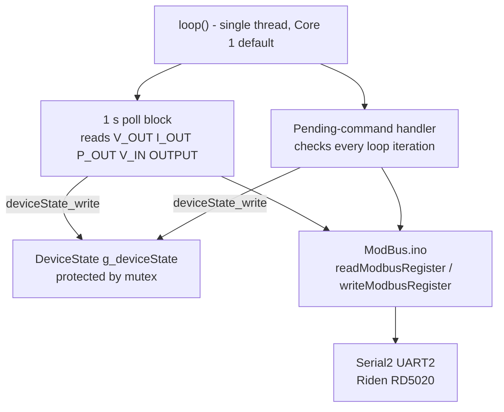

# Iteration 7: Shared Device State - Dual-Core Architecture Foundation

## Goal

Introduce the shared data architecture that will connect the WebServer thread (Core 0) and the
Modbus thread (Core 1). This iteration does **not** change any existing WiFi or Modbus logic -
it only adds the new files and wires them into the existing sketch so the structure compiles and
the mutex-protected accessors can be verified via the Serial Monitor.

---

## Background & Design Decisions

### Why a shared struct is needed

The WebServer (Core 0) needs to display current converter values. The Modbus task (Core 1) is
the only code that may touch `Serial2`. These two threads must never directly call each other's
code. The safe handshake is a **mutex-protected shared struct** - the standard "Isolation
Pattern" described in `Threads/Threads.md`.

### Polling strategy

The Riden RD5020 does **not** push unsolicited data; it is a pure request/response Modbus slave.
The Modbus thread will therefore **poll** the device every ~1 second to refresh read-back values
(V_OUT, I_OUT, power). Write operations (set voltage, set current, output on/off) are triggered
on demand from the web layer via a pending-command mechanism described below.

### Language: simple C++

A plain `struct` with a `SemaphoreHandle_t` member and free functions is the minimal change.
Two subclasses (`RidenDevice`, `XylinkDevice`) each provide the device-specific register map but
share the same base interface. No templates. No STL.

### Command handoff (Web → Modbus)

The web handler cannot call Modbus directly (wrong core, wrong thread). Instead it writes a
pending command into the shared struct while holding the mutex, then immediately returns. The
Modbus task reads and clears the pending command on its next iteration and executes it.

This keeps Modbus fully isolated on Core 1 and avoids FreeRTOS Queue complexity for this stage.

### Architecture at the end of Iteration 7

---

## Register Map (Riden RD5020 / DPS5020)

> **Note:** The existing code uses placeholder addresses. This iteration introduces the correct
> register map based on the standard Riden/DPS Modbus specification.

| Constant         | Address  | R/W | Unit   | Description                    |
|------------------|----------|-----|--------|--------------------------------|
| `REG_MODEL`      | `0x0000` | R   | -      | Model number (e.g. 5020)       |
| `REG_FW`         | `0x0001` | R   | -      | Firmware version                |
| `REG_V_SET`      | `0x0002` | R/W | 0.01 V | Voltage set-point               |
| `REG_I_SET`      | `0x0003` | R/W | 0.01 A | Current set-point               |
| `REG_V_OUT`      | `0x0004` | R   | 0.01 V | Actual output voltage           |
| `REG_I_OUT`      | `0x0005` | R   | 0.01 A | Actual output current           |
| `REG_P_OUT`      | `0x0006` | R   | 0.01 W | Actual output power             |
| `REG_V_IN`       | `0x0007` | R   | 0.01 V | Input voltage                   |
| `REG_KEYLOCK`    | `0x0008` | R/W | bool   | Keypad lock (1 = locked)        |
| `REG_OVP`        | `0x0009` | R/W | 0.01 V | Over-voltage protection         |
| `REG_OCP`        | `0x000A` | R/W | 0.01 A | Over-current protection         |
| `REG_OUTPUT`     | `0x0012` | R/W | bool   | Output ON (1) / OFF (0)         |

> All values are 16-bit unsigned integers. Voltage and current are stored as integer × 100
> (e.g. 1250 = 12.50 V). Power is integer × 100 (e.g. 1500 = 15.00 W).

---

## Files Introduced / Changed

| File | Action | Purpose |
|------|--------|---------|
| `SerialController/DeviceState.h` | **New** | `DeviceState` struct + mutex wrapper + `PendingCmd` enum |
| `SerialController/DeviceState.ino` | **New** | Init, safe read/write accessor implementations |
| `SerialController/SerialController.ino` | **Edit** | Include header, create global instance, update register defines |
| `SerialController/ModBus.ino` | **No change** | Modbus protocol stays untouched |
| `SerialController/Server.ino` | **No change** | Server stays untouched |

---

## Sub-Tasks

---

### Sub-Task 7.1 - Define `DeviceState.h`

**Intent:** Declare the shared data struct, the pending-command enum, and the accessor function
prototypes in a header that both `.ino` files can include.

**Expected Outcomes:**
- `DeviceState.h` exists and compiles without errors.
- All converter values (set-points, read-backs, protection limits, flags) have a named field.
- A `PendingCmd` enum lists every write operation the web layer can request.
- Function prototypes are declared for `deviceState_init`, `deviceState_read`,
  `deviceState_write`, and `deviceState_setPending` / `deviceState_takePending`.

**Todo List:**
1. Create `SerialController/DeviceState.h`.
2. Define `enum PendingCmd` with values:
   `CMD_NONE`, `CMD_SET_VOLTAGE`, `CMD_SET_CURRENT`, `CMD_SET_OVP`, `CMD_SET_OCP`,
   `CMD_OUTPUT_ON`, `CMD_OUTPUT_OFF`, `CMD_SET_KEYLOCK`.
3. Define `struct DeviceState` with fields:
   - Read-back fields (`float vOut`, `float iOut`, `float pOut`, `float vIn`).
   - Set-point fields (`float vSet`, `float iSet`).
   - Protection fields (`float ovp`, `float ocp`).
   - Flag fields (`bool outputOn`, `bool keylock`).
   - Info fields (`uint16_t model`, `uint16_t firmware`).
   - Status field (`bool modbusOk`) - set `false` if last poll failed.
   - Pending command fields: `PendingCmd pendingCmd` and `float pendingValue`.
   - The FreeRTOS mutex handle: `SemaphoreHandle_t mutex`.
4. Declare free-function prototypes (not methods - keeps it plain C-style callable from any
   `.ino` file):
   - `void deviceState_init(DeviceState* ds)` - creates the mutex, zeroes all fields.
   - `void deviceState_read(DeviceState* ds, DeviceState* snapshot)` - copies the struct
     under mutex into `snapshot`.
   - `void deviceState_write(DeviceState* ds, const DeviceState* src)` - merges fields
     from `src` under mutex.
   - `void deviceState_setPending(DeviceState* ds, PendingCmd cmd, float value)` - sets the
     pending command under mutex.
   - `bool deviceState_takePending(DeviceState* ds, PendingCmd* cmd, float* value)` - atomically
     reads and clears the pending command; returns `true` if a command was waiting.

**Relevant Context:** `Threads/Threads.ino` `SafeStats` class pattern; FreeRTOS
`xSemaphoreCreateMutex`, `xSemaphoreTake`, `xSemaphoreGive`.

**Status:** `[ ] pending`

---

### Sub-Task 7.2 - Implement `DeviceState.ino`

**Intent:** Provide the function bodies declared in `DeviceState.h`. All mutex
acquire/release logic lives here. No Modbus or HTTP code belongs in this file.

**Expected Outcomes:**
- All five functions compile and operate correctly.
- The mutex is always released - even on early-return paths.
- A 10 ms timeout is used for `xSemaphoreTake` (never block forever from the web handler,
  which must stay responsive).
- Each function logs a single `ESP_LOGV` / `ESP_LOGE` line so failures are visible in Serial
  Monitor without flooding the output.

**Todo List:**
1. Create `SerialController/DeviceState.ino`.
2. Include `DeviceState.h` and `esp_log.h`.
3. Define `TAG_DS = "DEVICE_STATE"`.
4. Implement `deviceState_init`: call `xSemaphoreCreateMutex()`, assign to `ds->mutex`,
   `memset` the rest to zero.
5. Implement `deviceState_read`: take mutex with 10 ms timeout → `memcpy` whole struct
   (excluding `mutex` field) into `snapshot` → give mutex. On timeout log error and leave
   snapshot unchanged.
6. Implement `deviceState_write`: take mutex with 10 ms timeout → copy only the
   non-mutex fields from `src` into `ds` → give mutex.
7. Implement `deviceState_setPending`: take mutex → set `pendingCmd` and `pendingValue` →
   give mutex.
8. Implement `deviceState_takePending`: take mutex → if `pendingCmd != CMD_NONE`, copy out
   cmd and value, set `pendingCmd = CMD_NONE`, give mutex, return `true` → else give mutex,
   return `false`.

**Relevant Context:** `Threads/Threads.ino` `getCounts()` / `incCore0()` patterns.

**Status:** `[ ] pending`

---

### Sub-Task 7.3 - Wire into `SerialController.ino`

**Intent:** Create the single global `DeviceState` instance, call `deviceState_init` in
`setup()`, update the register address `#define`s to the correct values, and replace the
background voltage-toggle test task with a Modbus poll loop that reads live values into the
shared state.

**Expected Outcomes:**
- One global `DeviceState g_deviceState` declared at top of `SerialController.ino`.
- `deviceState_init(&g_deviceState)` called in `setup()` before `setupServer()`.
- Existing background toggle task removed from `loop()`.
- New background poll in `loop()` (every 1000 ms) calls `readModbusRegister` for each
  read-back register and calls `deviceState_write` to store results.
- The `PendingCmd` check runs on every `loop()` iteration (not just every second) so
  write commands from the web handler are executed promptly.
- Serial Monitor shows a one-line poll summary: vOut, iOut, pOut every second.

**Todo List:**
1. Add `#include "DeviceState.h"` at the top of `SerialController.ino`.
2. Declare `DeviceState g_deviceState;` as a global.
3. Add `extern DeviceState g_deviceState;` declaration comment so `Server.ino` can reference
   it (Arduino IDE compiles all `.ino` files as one translation unit; the extern is for clarity).
4. Update register `#define`s to match the table in this document.
5. In `setup()`, insert `deviceState_init(&g_deviceState);` before `setupServer()`.
6. Replace the 30-second toggle block in `loop()` with:
   a. A pending-command handler: call `deviceState_takePending`, if command received, execute
      the correct `writeModbusRegister` call, write the result back with `deviceState_write`.
   b. A 1-second poll block: read `REG_V_OUT`, `REG_I_OUT`, `REG_P_OUT`, `REG_V_IN`,
      `REG_OUTPUT`, pack into a local `DeviceState tmp`, call `deviceState_write`.

**Relevant Context:** Existing [`loop()`](SerialController/SerialController.ino:47),
[`readModbusRegister`](SerialController/ModBus.ino:64),
[`writeModbusRegister`](SerialController/ModBus.ino:114).

**Status:** `[ ] pending`

---

### Sub-Task 7.4 - Smoke-test via Serial Monitor

**Intent:** Verify the shared state is working correctly before the web layer uses it - no
hardware changes, no Server.ino changes.

**Expected Outcomes:**
- Sketch compiles without warnings.
- Serial Monitor at 115200 baud shows a poll line every second.
- When Riden is not connected, `modbusOk = false` is visible in the log and the sketch does
  not crash or hang.
- When Riden is connected, actual voltage and current values appear in the poll line.
- Calling `GET /status` still works (Server.ino untouched).

**Todo List:**
1. Flash the updated sketch to the ESP32.
2. Open Serial Monitor at 115200 baud.
3. Confirm poll log lines appear every ~1 second.
4. Confirm no Guru Meditation / watchdog resets occur over a 60-second run.
5. (Optional, if Riden connected) Verify values match the Riden display.

**Relevant Context:** `SerialController/platformio.ini` `monitor_speed = 115200`.

**Status:** `[ ] pending`

---

## What Is Explicitly Out of Scope for Iteration 7

- **No threading yet** - the dual-core split (Web on Core 0, Modbus on Core 1) is Iteration 8.
  `loop()` still runs everything sequentially on Core 1 (Arduino default). The mutex is
  introduced now so the data structure is thread-ready when threads arrive.
- **No web UI changes** - `Server.ino` and `handleRoot()` are not touched.
- **No Xylink subclass** - the base `DeviceState` + Riden register map is sufficient for now.
  The Xylink subclass (different register addresses, same struct shape) is Iteration 9+.
- **No persistent settings** - OVP/OCP set-points are not stored to NVS in this iteration.

---

## Next Step

After Iteration 7 is verified, **Iteration 8** will split the sketch into two pinned FreeRTOS
tasks (`xTaskCreatePinnedToCore`): the WebServer task on Core 0 and the Modbus polling/command
task on Core 1. The `g_deviceState` mutex will then be doing real concurrent work.
