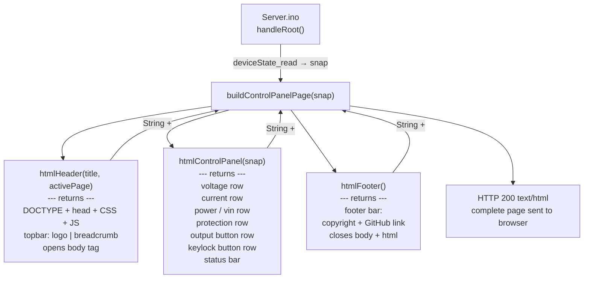
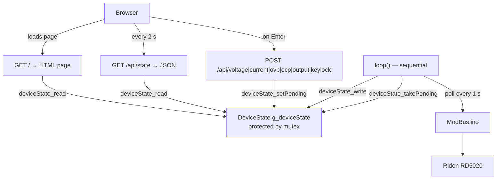

# Iteration 8: Web UI and REST API for DeviceState

## Goal

Replace the current API-reference root page in `Server.ino` with a real control panel that:
- Displays all live `DeviceState` values (read from `g_deviceState` via the mutex accessor).
- Lets the user set voltage, current, OVP, OCP, and toggle the output on/off.
- Auto-refreshes the displayed values every 2 seconds by polling a lightweight JSON endpoint.
- Exposes a clean REST API so external tools (curl, Postman, scripts) can read and write every
  value programmatically.

This iteration does **not** yet split the code into two FreeRTOS tasks (that is Iteration 9).
It does **not** touch `ModBus.ino` or `DeviceState.h/.ino`.

---

## Background & Design Decisions

### WebSockets vs. HTTP Polling

WebSockets provide a persistent bi-directional connection and allow the server to **push**
updates to the browser the moment a value changes. That sounds attractive, but:

- The ESP32 `WebServer.h` library does **not** include WebSocket support. A separate library
  (`arduinoWebSockets` by Links2004) would be needed — an additional dependency, extra RAM
  overhead (~4–8 KB heap per open connection), and significant added complexity in `Server.ino`.
- The Modbus poll in Iteration 7 refreshes `g_deviceState` every **1 second** at best. There
  is therefore never any fresher data to push. A WebSocket push every second provides no benefit
  over an HTTP poll every second.
- With a single connected browser the polling load on the ESP32 is negligible (one small HTTP
  GET per 2 seconds).

**Decision: use plain HTTP polling.** The page uses `setInterval` to call `GET /api/state`
every 2 seconds and updates the DOM. No extra library. No persistent connection. No added
complexity. This can be revisited in a future iteration if multiple simultaneous clients are
needed.

### REST API design

All API endpoints live under the `/api/` path prefix to clearly separate them from the UI root.

| Endpoint              | Method | Body / Params          | Description                          |
|-----------------------|--------|------------------------|--------------------------------------|
| `GET /`               | GET    | —                      | Serves the HTML control panel        |
| `GET /api/state`      | GET    | —                      | Full `DeviceState` as JSON           |
| `POST /api/voltage`   | POST   | `v=12.50` (form)       | Set voltage set-point                |
| `POST /api/current`   | POST   | `i=2.00` (form)        | Set current set-point                |
| `POST /api/ovp`       | POST   | `v=13.00` (form)       | Set over-voltage protection          |
| `POST /api/ocp`       | POST   | `i=3.00` (form)        | Set over-current protection          |
| `POST /api/output`    | POST   | `on=1` or `on=0`       | Turn output ON or OFF                |
| `POST /api/keylock`   | POST   | `lock=1` or `lock=0`   | Lock or unlock the keypad            |
| `GET /status`         | GET    | —                      | ESP32 chip/WiFi/memory info (keep)   |
| `GET /reset`          | GET    | —                      | Clear WiFi credentials (keep)        |

All POST handlers write a `PendingCmd` into `g_deviceState` via `deviceState_setPending` and
return immediately with `202 Accepted`. The Modbus task picks it up on its next loop iteration.
The browser re-polls `/api/state` 2 seconds later to confirm the change.

### HtmlService — separation of rendering from routing

All HTML generation is isolated in a dedicated `HtmlService.ino`. `Server.ino` owns routing and
request parsing only — it never contains raw HTML strings. This keeps each file focused and
makes it easy to add a second page (e.g. a `/settings` page) in a future iteration by reusing
the same header and footer from `HtmlService.ino`.

`HtmlService.ino` exposes three building-block functions and one composed page function:

| Function | Returns | Description |
|---|---|---|
| `htmlHeader(const char* title, const char* activePage)` | `String` | `<!DOCTYPE html>` … `<body>` open tag, shared CSS, nav breadcrumb |
| `htmlFooter()` | `String` | Closes `<body>` and `<html>`, renders the footer bar |
| `htmlControlPanel(DeviceState* snap)` | `String` | The control panel body rows only (no header/footer HTML) |
| `buildControlPanelPage(DeviceState* snap)` | `String` | Calls `htmlHeader + htmlControlPanel + htmlFooter` — the full page |

`Server.ino`'s `handleRoot()` calls only `buildControlPanelPage(&snap)` and sends the result.

### HtmlService function composition diagram



### Page header and footer content

**Header** (`htmlHeader`):
- Standard `<meta charset>`, viewport, and `<title>` tags.
- Shared CSS block (dark theme, 7-segment style, input/button styles, layout classes).
- A slim top bar containing:
  - Left: project name `SerialController` as a plain text logo.
  - Right: a breadcrumb showing the current page name (passed as `activePage` parameter,
    e.g. `"Control Panel"`).
- The JavaScript `poll()` and `submitField()` functions are embedded here so they are
  available to every page that uses this header.

**Footer** (`htmlFooter`):
- A slim bottom bar containing:
  - Copyright line: `© 2025 WarpGuru`.
  - Link to source repository: `https://github.com/Warpguru/ESP` (opens in new tab).

### Web page layout

The page is one self-contained HTML response assembled from header + body + footer.
No external files, no CDN, no framework. The style uses a dark background (`#1a1a1a`) with
bright green digits styled with a monospace font (`font-family: 'Courier New', monospace`) to
evoke the 7-segment LED look — without loading a custom web font.

Layout (top to bottom, single column, centred, max-width 480 px):

```
┌─────────────────────────────────────┐
│  SerialController  [●ON] / [○OFF]   │  ← title + output toggle button
├──────────────┬──────────────────────┤
│  SET  12.50V │  OUT  11.87V         │  ← voltage row
│  SET   2.00A │  OUT   1.43A         │  ← current row
│              │  PWR  16.98W         │  ← power row (read-only)
│              │  VIN  14.02V         │  ← input voltage (read-only)
├─────────────────────────────────────┤
│  OVP  13.00V       OCP   2.50A      │  ← protection row
├─────────────────────────────────────┤
│  🔒 Keylock  [LOCK] / [UNLOCK]      │  ← keylock row
├─────────────────────────────────────┤
│  ⚠ Modbus offline                   │  ← status bar (hidden when ok)
└─────────────────────────────────────┘
```

Each **SET** value is a text `<input>` element:
- Displays the last known set-point as its value on load and after every poll.
- The user types a new value. While typing, the displayed number is white (editing).
- **Enter** submits the change via `fetch` POST and turns the field green briefly.
- **Escape** discards the edit and restores the previous set-point value (no request sent).
- No submit button is needed (keyboard-driven as requested), but a small `[↵]` hint label
  sits beside each input so it is discoverable.

Each **OUT / PWR / VIN** value is a read-only `<span>` updated by the 2-second poll.

The **Output ON/OFF** button toggles with a single click. It shows green `● ON` or grey `○ OFF`.

### Architecture at the end of Iteration 8



---

## Files Changed

| File | Action | Purpose |
|------|--------|---------|
| `SerialController/HtmlService.ino` | **New** | `htmlHeader()`, `htmlFooter()`, `htmlControlPanel()`, `buildControlPanelPage()` |
| `SerialController/Server.ino` | **Edit** | Replace `handleRoot`, remove old `/voltage`+`/setVoltage`, add `/api/state` + all `/api/*` POST handlers; call `HtmlService` functions for HTML |
| `SerialController/DeviceState.h` | **No change** | Struct and prototypes already complete after Iteration 7 |
| `SerialController/DeviceState.ino` | **No change** | Accessor implementations unchanged |
| `SerialController/ModBus.ino` | **No change** | Protocol layer untouched |
| `SerialController/SerialController.ino` | **No change** | Poll loop and pending-command handler unchanged |

---

## Sub-Tasks

---

### Sub-Task 8.1 — Add `GET /api/state` JSON endpoint

**Intent:** Provide a single endpoint that serialises the entire `DeviceState` snapshot to JSON.
This is the data source for both the browser's 2-second poll and for external API consumers.

**Expected Outcomes:**
- `GET /api/state` returns HTTP 200 with `Content-Type: application/json`.
- JSON contains all fields: `vSet`, `iSet`, `vOut`, `iOut`, `pOut`, `vIn`, `ovp`, `ocp`,
  `outputOn`, `keylock`, `modbusOk`, `model`, `firmware`.
- All float values are serialised to 2 decimal places.
- If the mutex times out, HTTP 503 is returned with `{"error":"state_locked"}`.
- Old endpoints `GET /voltage` and `POST /setVoltage` are **removed** (replaced by the new API).

**Todo List:**
1. In `Server.ino`, add `void handleGetState()`.
2. Call `deviceState_read(&g_deviceState, &snap)` to get a mutex-safe snapshot.
3. Build the JSON string from `snap` fields using `String` concatenation (no JSON library needed
   at this scale).
4. Register the route: `server.on("/api/state", HTTP_GET, handleGetState)` in `setupServer()`.
5. Remove the `handleGetVoltage` and `handleSetVoltage` functions and their route registrations.

**Relevant Context:** Existing [`handleGetStatus()`](SerialController/Server.ino:84) for the
JSON-building pattern; [`deviceState_read`](SerialController/DeviceState.h) prototype.

**Status:** `[ ] pending`

---

### Sub-Task 8.2 — Add POST handlers for all writable fields

**Intent:** Give the REST API and the web page a route for every field the user can change.
Each handler validates input, calls `deviceState_setPending`, and returns `202 Accepted`
immediately — it does **not** wait for the Modbus task to execute the command.

**Expected Outcomes:**
- Six POST routes registered: `/api/voltage`, `/api/current`, `/api/ovp`, `/api/ocp`,
  `/api/output`, `/api/keylock`.
- Each handler validates that the required parameter is present and within a sane range
  (voltage 0–52 V, current 0–20 A) and returns HTTP 400 if not.
- Returns HTTP 202 with a plain-text confirmation (`"Accepted: voltage=12.50"`).
- The Modbus task's `deviceState_takePending` loop (from Iteration 7, Sub-Task 7.3) picks up
  the command within one loop iteration (~1 s worst case).

**Todo List:**
1. Add `void handleSetVoltage()` — reads param `v`, validates range 0.0–52.0, calls
   `deviceState_setPending(&g_deviceState, CMD_SET_VOLTAGE, v)`.
2. Add `void handleSetCurrent()` — reads param `i`, validates range 0.0–20.0, calls
   `deviceState_setPending(&g_deviceState, CMD_SET_CURRENT, i)`.
3. Add `void handleSetOVP()` — reads param `v`, validates range 0.0–55.0.
4. Add `void handleSetOCP()` — reads param `i`, validates range 0.0–22.0.
5. Add `void handleSetOutput()` — reads param `on` (value `"1"` or `"0"`), calls
   `deviceState_setPending` with `CMD_OUTPUT_ON` or `CMD_OUTPUT_OFF` (value unused = 0).
6. Add `void handleSetKeylock()` — reads param `lock` (`"1"` or `"0"`), calls
   `deviceState_setPending` with `CMD_SET_KEYLOCK`.
7. Register all six routes in `setupServer()`.

**Relevant Context:** [`PendingCmd` enum](SerialController/DeviceState.h);
[`deviceState_setPending`](SerialController/DeviceState.h) prototype.

**Status:** `[ ] pending`

---

### Sub-Task 8.3 — Create `HtmlService.ino`

**Intent:** Implement all HTML rendering in one dedicated file, cleanly separated from routing
logic in `Server.ino`. Header and footer are reusable building blocks. The control panel body
is a separate function so a second page can be added later with a one-line change.

**Expected Outcomes:**
- `HtmlService.ino` compiles as part of the sketch with no errors.
- `buildControlPanelPage()` returns a complete, valid HTML document as a `String`.
- The header contains the shared CSS, JavaScript, and the top navigation bar.
- The footer contains the copyright line and GitHub link.
- No HTML strings exist anywhere in `Server.ino`.

**Todo List:**
1. Create `SerialController/HtmlService.ino`.
2. Implement `String htmlHeader(const char* title, const char* activePage)`:
   - Outputs `<!DOCTYPE html><html><head>` with `<meta charset="UTF-8">`, viewport meta,
     and `<title>` set to `title`.
   - Embeds the full shared CSS block (dark theme: background `#1a1a1a`, green `#00e676`
     readback values, white `#ffffff` set-point inputs, amber `#ffc107` protection values,
     red `#ff1744` offline banner; `font-family: 'Courier New', monospace` throughout;
     `2rem` font size for readback spans; input sized for 5 characters `52.00`).
   - Embeds the shared JavaScript block:
     - `poll()` — `fetch('/api/state')` → parse JSON → update readback `<span>` elements
       and store confirmed set-point values in each input's `data-last` attribute (update
       `value` only when the field does not have focus, so in-progress typing is never
       overwritten) → show/hide the offline banner based on `modbusOk`.
     - `submitField(el, path, param)` — POSTs `param=value` to `path`, on success briefly
       adds CSS class `ok` (green border for 1 s) to the input element.
     - `keyHandler(event, path, param)` — called from each input's `onkeydown`:
       `Enter` → call `submitField`; `Escape` → restore `el.value` from `el.dataset.last`
       and blur the field.
     - `toggleOutput()` and `toggleKeylock()` — read current state from a `data-state`
       attribute, POST the inverse, immediately call `poll()`.
     - `window.onload = function() { poll(); setInterval(poll, 2000); };`
   - Closes `</head>` and opens `<body>`.
   - Renders the top bar `<div class="topbar">`:
     - Left: `<span class="logo">SerialController</span>`.
     - Right: `<span class="breadcrumb">` showing `activePage`.
3. Implement `String htmlFooter()`:
   - Renders `<div class="footer">`:
     - `© 2025 WarpGuru`
     - `<a href="https://github.com/Warpguru/ESP" target="_blank">github.com/Warpguru/ESP</a>`
   - Closes `</body></html>`.
4. Implement `String htmlControlPanel(DeviceState* snap)`:
   - Returns **only** the body content rows (no `<html>`, `<head>`, or `<body>` tags).
   - One `<div class="row">` per measurement group, matching the wireframe:
     - Voltage row: SET input (`id="vSet"`, `onkeydown="keyHandler(event,'/api/voltage','v')"`),
       OUT readback span (`id="vOut"`).
     - Current row: SET input (`id="iSet"`), OUT span (`id="iOut"`).
     - Power/VIN row: read-only spans for `id="pOut"` and `id="vIn"`.
     - Protection row: OVP input (`id="ovp"`), OCP input (`id="ocp"`).
     - Output row: button (`id="btnOutput"`, `onclick="toggleOutput()"`), label.
     - Keylock row: button (`id="btnKeylock"`, `onclick="toggleKeylock()"`), label.
     - Status bar: `<div id="statusBar" class="offline" style="display:none">⚠ Modbus offline</div>`.
   - Each input's `value` attribute is pre-populated from the `snap` fields so the first
     page load shows current set-points immediately without waiting for the first `poll()`.
   - Each readback span is pre-populated from `snap` read-back fields likewise.
5. Implement `String buildControlPanelPage(DeviceState* snap)`:
   - Returns `htmlHeader("SerialController", "Control Panel") + htmlControlPanel(snap) + htmlFooter()`.

**Relevant Context:** Iteration 6.md web page for style reference;
[`handleRoot()`](SerialController/Server.ino:132) to be replaced in Sub-Task 8.4.

**Status:** `[ ] pending`

---

### Sub-Task 8.4 — Update `handleRoot()` and `setupServer()` in `Server.ino`

**Intent:** Slim down `handleRoot()` to a single call into `HtmlService`, register all new
API routes, and remove the old superseded routes.

**Expected Outcomes:**
- `handleRoot()` contains only: take a `DeviceState` snapshot, call
  `buildControlPanelPage(&snap)`, and `server.send(200, "text/html", page)`.
- No HTML strings remain in `Server.ino`.
- All `/api/*` routes are registered; old `/voltage` and `/setVoltage` routes are gone.
- Serial Monitor startup log lists every registered route.

**Todo List:**
1. Rewrite `handleRoot()` — call `deviceState_read`, pass snapshot to `buildControlPanelPage`,
   send result.
2. Remove the old `handleGetVoltage` and `handleSetVoltage` functions.
3. Remove their route registrations from `setupServer()`.
4. Add route registrations for all `/api/*` handlers from Sub-Tasks 8.1 and 8.2.
5. Add a startup log block that prints each registered route path to Serial.

**Relevant Context:** [`setupServer()`](SerialController/Server.ino:183);
[`handleRoot()`](SerialController/Server.ino:132).

**Status:** `[ ] pending`

### Sub-Task 8.5 — End-to-end verification

**Intent:** Confirm all UI interactions and API calls work correctly before Iteration 9 adds
real threading.

**Expected Outcomes:**
- Browser loads `http://<ESP_IP>/` and shows the control panel.
- Values update every 2 seconds (or show `--` placeholders when Modbus is offline).
- Typing `12.50` in the Voltage SET field and pressing Enter sends `POST /api/voltage?v=12.50`,
  the input flashes green, and 2 seconds later the Modbus offline indicator is absent (if Riden
  is connected) or the value is accepted into pending state (if not).
- Pressing Escape restores the previous value with no network request.
- `curl http://<ESP_IP>/api/state` returns valid JSON.
- `curl -X POST "http://<ESP_IP>/api/voltage?v=5.0"` returns HTTP 202.
- `GET /status` and `GET /reset` still work unchanged.

**Todo List:**
1. Flash the updated sketch.
2. Open `http://<ESP_IP>/` in a browser. Verify layout matches the wireframe above.
3. Verify 2-second auto-refresh in the browser's Network tab (DevTools).
4. Test Enter and Escape keyboard behaviour on each input field.
5. Test Output ON/OFF button.
6. Run the curl commands above and verify responses.
7. Confirm no Guru Meditation errors over a 5-minute run.

**Status:** `[ ] pending`

---

## What Is Explicitly Out of Scope for Iteration 8

- **No dual-core threading** — the WebServer still runs in `loop()` on the Arduino default core.
  FreeRTOS task pinning is Iteration 9.
- **No Xylink support** — `DeviceState` is still Riden-only.
- **No persistent OVP/OCP** — protection values are not stored to NVS.
- **No authentication** — the web page and API are open on the local network. Suitable for home
  lab use; security hardening is out of scope.
- **No WebSockets** — decided against above; HTTP polling is sufficient given 1-second Modbus
  poll rate and single-client use.

---

## Next Step

After Iteration 8 is verified, **Iteration 9** will pin the WebServer to Core 0 and the Modbus
poll/command loop to Core 1 using `xTaskCreatePinnedToCore`, following the pattern established
in `Threads/Threads.ino`. The `g_deviceState` mutex introduced in Iteration 7 will then be
doing real concurrent work across two physical cores.
