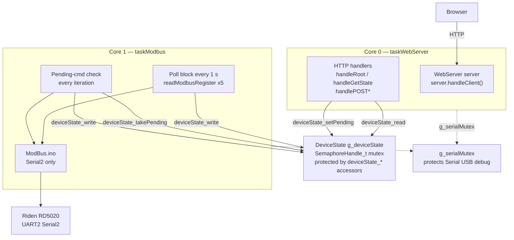

# Iteration 9: Dual-Core Split — WebServer on Core 0, Modbus on Core 1

## Goal

Split the single sequential `loop()` into two pinned FreeRTOS tasks so that:

- **Core 0** owns the `WebServer` exclusively — it runs `server.handleClient()` in a tight
  loop and never touches `Serial2` or any Modbus function.
- **Core 1** owns `Serial2` and all Modbus I/O exclusively — it polls `g_deviceState` every
  1 second and executes pending write commands. It never calls any `WebServer` function.
- Both tasks share `g_deviceState` safely through the mutex-protected accessors introduced in
  Iteration 7 (`deviceState_read`, `deviceState_write`, `deviceState_setPending`,
  `deviceState_takePending`).
- `Serial` (the USB debug port) is shared between both tasks via `serialLog()` — a thin
  thread-safe helper introduced in this iteration that prefixes every line with `[Core x]`
  so output from both cores is always identifiable.

After this iteration `loop()` in `SerialController.ino` becomes an **empty watchdog** — all
real work happens inside the two pinned tasks.

---

## Background & Design Decisions

### Why the split is done now

Iterations 7 and 8 deliberately ran everything sequentially in `loop()`. This made each layer
testable in isolation before adding concurrent complexity. The mutex in `g_deviceState` was
always taken and released by the same thread, so it was never actually contended — it just
proved the accessor API compiled and worked correctly. Iteration 9 activates real concurrency
for the first time: after this point the mutex will be contended between two physical cores.

### Core assignment rationale

Per `Threads/Threads.md` and the ESP-IDF documentation:

- **Core 0** is where the ESP32 WiFi radio interrupt handler runs internally. Keeping the
  `WebServer` on Core 0 ensures HTTP request processing happens on the same core as the WiFi
  stack, minimising context switches and reducing the risk of timing issues in the WiFi driver.
- **Core 1** is the Arduino default core (where `setup()` and `loop()` run). Moving the Modbus
  poll here keeps it on the core that initialised `Serial2`, avoiding any hardware peripheral
  re-initialisation.

### Library isolation (the "Isolation Pattern")

- `WebServer server` is declared in `Server.ino`. After the Core 0 task starts, **only** the
  Core 0 task calls `server.handleClient()`, `server.send()`, and all handler functions.
  No other code ever calls these after task creation.
- `Serial2` is initialised in `setup()` (Core 1 default). After the Core 1 task starts,
  **only** the Core 1 task calls `Serial2.write()`, `Serial2.read()`, and
  `Serial2.available()`. `ModBus.ino` functions are called only from the Core 1 task.

### `Serial` (USB debug) — `SerialStdout.ino`

`Serial.print` / `Serial.printf` called simultaneously from two cores produces garbled output
and can cause rare crashes. Rather than scattering raw `xSemaphoreTake` / `xSemaphoreGive`
pairs around every `Serial.*` call site, a single helper function centralises all of this:

```cpp
void serialLog(const char* tag, const char* fmt, ...);
```

Internally it:
1. Calls `xPortGetCoreID()` to obtain the current core number (`0` or `1`) at the moment of
   the call — no argument needed from the caller.
2. Takes `g_serialMutex` with a 10 ms timeout.
3. Prints the line as: `[Core x][TAG] message\n`
4. Gives `g_serialMutex`.

Every bare `Serial.*` call and every `ESP_LOG*` call in the project is replaced with a single
`serialLog(TAG, fmt, ...)` call. The result in the Serial Monitor looks like:

```
[Core 1][MODBUS] TX: 01 03 00 04 00 01 C5 CB
[Core 0][SERVER] Request: GET /api/state
[Core 1][MODBUS] RX: 01 03 02 04 B0 B8 FA
[Core 1][MODBUS Poll] V=12.00 I=1.43 P=17.16
[Core 0][SERVER] Request: GET /api/state
```

This makes it immediately visible which core produced each line — essential for diagnosing
any future concurrency issue.

`g_serialMutex` is a global `SemaphoreHandle_t` declared in `SerialController.ino` and
created in `setup()` before `Serial.begin` — the same approach as `SerialMutex` in
`Threads/Threads.ino` (line 75).

### Stack sizes

The default Arduino `loop()` task uses 8 192 bytes. Both new tasks need more:

| Task | Stack | Reason |
|---|---|---|
| `taskWebServer` (Core 0) | `12 000` bytes | `WebServer` + `WiFiManager` + `HtmlService` String building |
| `taskModbus` (Core 1) | `8 000` bytes | Modbus frame buffers + `DeviceState` snapshot copy |

These are conservative starting values. If a stack overflow occurs the ESP32 will print
`Guru Meditation Error: Core X panic'ed (Unhandled debug exception)` and the tag
`"STACKOVERFLOW"`. They can be tuned down later.

### Task priorities

Both tasks are created at priority `1` (same as the default Arduino loop task). Neither task
should starve the other; both spend most of their time blocked in `delay()` or waiting for
HTTP requests. The FreeRTOS scheduler on the ESP32 is preemptive with a 1 ms tick.

### `setup()` and `loop()` after the split

`setup()` continues to do all one-time initialisation (Serial, Serial2, DeviceState, WiFi,
WebServer routes) exactly as before. It then **launches the two tasks** and returns.

`loop()` becomes empty except for a `vTaskDelay(portMAX_DELAY)` — this suspends the Arduino
default loop task indefinitely so it consumes no CPU. The two pinned tasks run independently.

> **Important:** Do not call `delay()` inside `loop()` after the tasks are started — use
> `vTaskDelay(pdMS_TO_TICKS(ms))` inside the task functions instead. `delay()` in `loop()`
> would block Core 1 and starve the Modbus task.

---

## Architecture at the end of Iteration 9



---

## Files Changed

| File | Action | Purpose |
|---|---|---|
| `SerialController/SerialStdout.ino` | **New** | `serialLog()` — thread-safe, core-prefixed Serial output helper |
| `SerialController/SerialController.ino` | **Edit** | Add task constants, `g_serialMutex`, `TaskHandle_t` globals, task function prototypes, `taskWebServer()`, `taskModbus()`; update `setup()` to launch tasks; empty `loop()`; replace all `Serial.*` with `serialLog()` |
| `SerialController/Server.ino` | **Edit** | Remove `handleServerRequests()`; replace all `Serial.*` and `ESP_LOG*` with `serialLog()` |
| `SerialController/ModBus.ino` | **Edit** | Replace all `Serial.*` and `ESP_LOG*` with `serialLog()`; rewrite `logHex()` to use `serialLog()` |
| `SerialController/DeviceState.h` | **No change** | Struct and prototypes complete |
| `SerialController/DeviceState.ino` | **No change** | Accessor implementations unchanged |
| `SerialController/HtmlService.ino` | **No change** | HTML rendering unchanged |

---

## Sub-Tasks

---

### Sub-Task 9.1 — Create `SerialStdout.ino`

**Intent:** Provide a single, thread-safe logging function that any `.ino` file can call
without knowing anything about mutexes or core IDs. Every line it emits is automatically
prefixed with `[Core x]` so it is always clear which physical core produced the output.
This sub-task is done first, before any task infrastructure exists, so the function is
available to all subsequent sub-tasks.

**Expected Outcomes:**
- `SerialStdout.ino` compiles as part of the sketch with no errors.
- `serialLog(tag, fmt, ...)` prints exactly one line per call in the format:
  `[Core x][TAG] message\n` where `x` is `0` or `1`.
- The function is safe to call from any task on any core simultaneously — lines are never
  interleaved or garbled.
- If the mutex is not yet initialised (e.g. called from `setup()` before `g_serialMutex` is
  created) the function falls back to a direct `Serial.printf` so early startup messages
  are not lost.
- All existing bare `Serial.*` calls and `ESP_LOG*` calls across all `.ino` files are
  replaced with `serialLog()` calls as part of this sub-task, so the codebase has exactly
  one logging path from this point forward.

**Todo List:**
1. Create `SerialController/SerialStdout.ino`.
2. Include `Arduino.h`, `freertos/FreeRTOS.h`, `freertos/semphr.h`.
3. Declare `extern SemaphoreHandle_t g_serialMutex;` — the mutex is owned by
   `SerialController.ino`; `SerialStdout.ino` only references it.
4. Implement `void serialLog(const char* tag, const char* fmt, ...)`:
   - Call `xPortGetCoreID()` to get the current core number.
   - Format the message into a local `char buf[256]` using `vsnprintf(buf, sizeof(buf), fmt, args)`.
   - If `g_serialMutex != NULL`, take with `xSemaphoreTake(g_serialMutex, pdMS_TO_TICKS(10))`.
   - Call `Serial.printf("[Core %d][%s] %s\n", coreId, tag, buf)`.
   - If mutex was taken, give it back with `xSemaphoreGive(g_serialMutex)`.
5. In `SerialController.ino`, replace every `Serial.println(...)`, `Serial.printf(...)`,
   `ESP_LOGI(...)`, `ESP_LOGE(...)` call with the equivalent `serialLog(TAG_MAIN, ...)` call.
6. In `Server.ino`, replace every `Serial.println(...)`, `ESP_LOGI(TAG_SRV, ...)`,
   `ESP_LOGE(TAG_SRV, ...)`, `ESP_LOGW(TAG_SRV, ...)` call with `serialLog(TAG_SRV, ...)`.
7. In `ModBus.ino`, rewrite `logHex()` to build the hex string into a local buffer and emit
   it with a single `serialLog(TAG_MB, "TX/RX: %s", hexBuf)` call. Replace all `ESP_LOGE`
   and `ESP_LOGI` calls with `serialLog(TAG_MB, ...)`.
8. Verify the sketch compiles and that the Serial Monitor shows correctly prefixed single-core
   output (since tasks do not exist yet, every line will show `[Core 1]` — this is correct
   for `setup()` and `loop()` which run on Core 1 by default).

**Relevant Context:** `Diagnostics/Diagnostics.ino` `printDual()` (line 34) for the
`va_list` / `vsnprintf` pattern; `Threads/Threads.ino` `SerialMutex` usage (lines 75–79,
137–140); [`logHex()`](SerialController/ModBus.ino:22).

**Status:** `[ ] pending`

---

### Sub-Task 9.2 — Add task infrastructure to `SerialController.ino`

**Intent:** Declare all task-level constants, handles, and the shared `g_serialMutex` in one
place so both task functions and all `.ino` files can reference them.

**Expected Outcomes:**
- Task stack sizes, priorities, and core assignments are named constants at the top of
  `SerialController.ino`, not magic numbers.
- `g_serialMutex` is a global `SemaphoreHandle_t` declared in `SerialController.ino` so it is
  visible to all `.ino` files in the sketch (Arduino IDE compiles them as one translation unit).
- `TaskHandle_t` variables for both tasks are declared globally.
- Function prototypes for `taskWebServer`, `taskModbus`, and `serialLog` are declared before
  `setup()`.

**Todo List:**
1. Add the following constants near the top of `SerialController.ino`:
   ```
   #define TASK_STACK_WEB     12000
   #define TASK_STACK_MODBUS   8000
   #define TASK_PRIO_WEB          1
   #define TASK_PRIO_MODBUS       1
   #define CORE_WEB               0
   #define CORE_MODBUS            1
   #define MODBUS_POLL_MS      1000
   ```
2. Declare globals:
   ```
   SemaphoreHandle_t g_serialMutex = NULL;
   TaskHandle_t      g_taskWebHandle    = NULL;
   TaskHandle_t      g_taskModbusHandle = NULL;
   ```
3. Declare function prototypes:
   ```
   void taskWebServer(void* parameter);
   void taskModbus(void* parameter);
   void serialLog(const char* tag, const char* fmt, ...);
   ```

**Relevant Context:** `Threads/Threads.ino` lines 8–16 (constants), 63–65 (handles/mutex).

**Status:** `[ ] pending`

---

### Sub-Task 9.3 — Implement `taskWebServer()` on Core 0

**Intent:** Move `server.handleClient()` into a dedicated FreeRTOS task pinned to Core 0.
The task loops forever, calling `handleClient()` on every iteration with a short yield delay
to avoid starving the WiFi stack.

**Expected Outcomes:**
- `taskWebServer` is an infinite `for(;;)` loop.
- It calls `server.handleClient()` on every iteration.
- It yields for 10 ms via `vTaskDelay(pdMS_TO_TICKS(10))` — short enough to stay responsive
  to HTTP requests, long enough to yield CPU to the WiFi driver between calls.
- It never calls any Modbus function or touches `Serial2`.
- It never calls `delay()` (use `vTaskDelay` only inside tasks).
- A single startup log line is printed to `Serial` (under `g_serialMutex`) when the task first
  enters its loop.

**Todo List:**
1. Add `void taskWebServer(void* parameter)` to `SerialController.ino`.
2. Call `serialLog(TAG_MAIN, "taskWebServer running")` as the first statement — this will
   automatically emit `[Core 0][MAIN] taskWebServer running` since the task is pinned to Core 0.
3. Implement `for(;;)` body:
   - Call `server.handleClient()`.
   - Call `vTaskDelay(pdMS_TO_TICKS(10))`.

**Relevant Context:** `Threads/Threads.ino` `serialTaskCode()` (lines 130–144) for the task
skeleton pattern; `Threads/Threads.md` section 2 "Isolation Pattern".

**Status:** `[ ] pending`

---

### Sub-Task 9.4 — Implement `taskModbus()` on Core 1

**Intent:** Move the Modbus poll loop and pending-command handler (currently in `loop()` as
specified by Iteration 7) into a dedicated FreeRTOS task pinned to Core 1. This is the only
task permitted to call `readModbusRegister`, `writeModbusRegister`, or access `Serial2`.

**Expected Outcomes:**
- `taskModbus` is an infinite `for(;;)` loop.
- On every iteration it first checks for a pending command via `deviceState_takePending`;
  if one is found it executes the correct `writeModbusRegister` call immediately.
- Every `MODBUS_POLL_MS` (1000 ms) it reads all read-back registers (`REG_V_OUT`, `REG_I_OUT`,
  `REG_P_OUT`, `REG_V_IN`, `REG_OUTPUT`) and writes the results into `g_deviceState` via
  `deviceState_write`.
- `modbusOk` in `g_deviceState` is set `true` if all poll reads succeeded, `false` if any
  failed — the web UI reads this field to show/hide the offline banner.
- The task yields for 50 ms via `vTaskDelay(pdMS_TO_TICKS(50))` at the end of each iteration
  so the pending-command check runs ~20 times per second (fast command response) while the
  full poll only runs once per second.
- It never calls `server.handleClient()` or any HTTP handler.
- A single startup log line is printed to `Serial` (under `g_serialMutex`) on first entry.

**Todo List:**
1. Add `void taskModbus(void* parameter)` to `SerialController.ino`.
2. Declare local variables: `uint32_t lastPollMs = 0` and `DeviceState tmp`.
3. Call `serialLog(TAG_MAIN, "taskModbus running")` as the first statement — this will
   automatically emit `[Core 1][MAIN] taskModbus running`.
4. Implement `for(;;)` body:
   a. **Pending-command block** (runs every iteration):
      - Call `deviceState_takePending(&g_deviceState, &cmd, &val)`.
      - If `cmd != CMD_NONE`, use a `switch(cmd)` to call the correct
        `writeModbusRegister(RIDEN_ID, REG_xxx, (uint16_t)(val * 100))`.
      - After the write, call `serialLog(TAG_MAIN, "CMD %d -> %s", cmd, ok?"OK":"FAIL")`.
   b. **Poll block** (runs only when `millis() - lastPollMs >= MODBUS_POLL_MS`):
      - `lastPollMs = millis()`.
      - Zero `tmp`, then call `readModbusRegister` for each read-back register, storing
        results into the matching `tmp` fields.
      - Set `tmp.modbusOk = true` if all reads succeeded, `false` otherwise.
      - Call `deviceState_write(&g_deviceState, &tmp)`.
      - Call `serialLog(TAG_MAIN, "Poll V=%.2f I=%.2f P=%.2f ok=%d",
        tmp.vOut, tmp.iOut, tmp.pOut, tmp.modbusOk)`.
   c. `vTaskDelay(pdMS_TO_TICKS(50))`.

**Relevant Context:** Iteration 7 Sub-Task 7.3 (the poll + pending-cmd logic this task
replaces); `Threads/Threads.ino` `ledTaskCode()` (lines 147–176) for task skeleton;
[`readModbusRegister`](SerialController/ModBus.ino:64),
[`writeModbusRegister`](SerialController/ModBus.ino:114),
[`deviceState_takePending`](SerialController/DeviceState.h),
[`deviceState_write`](SerialController/DeviceState.h).

**Status:** `[ ] pending`

---

### Sub-Task 9.5 — Update `setup()` to create tasks and update `loop()`

**Intent:** `setup()` creates `g_serialMutex`, does all one-time hardware and WiFi
initialisation (as before), then launches both tasks with `xTaskCreatePinnedToCore`.
`loop()` is emptied — it suspends itself indefinitely so it consumes no CPU.

**Expected Outcomes:**
- `g_serialMutex` is created before any `Serial.*` call in `setup()`.
- Both tasks are created after `setupServer()` returns (WiFi and routes must be ready before
  the Web task starts serving requests).
- `xTaskCreatePinnedToCore` is called with the constants from Sub-Task 9.1.
- Return value of each `xTaskCreatePinnedToCore` is checked; a startup error is logged to
  `Serial` if task creation fails.
- `loop()` body is replaced with `vTaskDelay(portMAX_DELAY)` — one line only.
- `handleServerRequests()` is **removed** from `loop()` (it is no longer needed).

**Todo List:**
1. At the very start of `setup()`, before `Serial.begin`, add:
   `g_serialMutex = xSemaphoreCreateMutex();`
2. Replace the existing `Serial.println` startup lines with `serialLog(TAG_MAIN, ...)` calls.
   Because `g_serialMutex` is already initialised at this point, the mutex-safe path in
   `serialLog` is taken automatically. All lines will show `[Core 1]` since `setup()` runs
   on Core 1 — this is correct and expected.
3. After `setupServer()`, add task creation:
   ```
   BaseType_t webResult = xTaskCreatePinnedToCore(
       taskWebServer, "WebServer_Task",
       TASK_STACK_WEB, NULL, TASK_PRIO_WEB,
       &g_taskWebHandle, CORE_WEB);

   BaseType_t modbusResult = xTaskCreatePinnedToCore(
       taskModbus, "Modbus_Task",
       TASK_STACK_MODBUS, NULL, TASK_PRIO_MODBUS,
       &g_taskModbusHandle, CORE_MODBUS);
   ```
4. Log success or failure for each task creation under `g_serialMutex`.
5. Replace the entire body of `loop()` with `vTaskDelay(portMAX_DELAY);`.
6. Remove the call to `handleServerRequests()` from `loop()`.

**Relevant Context:** `Threads/Threads.ino` `setup()` lines 71–109 for the exact
`xTaskCreatePinnedToCore` call pattern and `SerialMutex` usage.

**Status:** `[ ] pending`

---

### Sub-Task 9.6 — Delete `handleServerRequests()` from `Server.ino`

**Intent:** The function `handleServerRequests()` was `loop()`'s way of driving the web
server. Now that `taskWebServer` calls `server.handleClient()` directly, the wrapper is dead
code and must be removed to avoid confusion.

**Expected Outcomes:**
- `handleServerRequests()` is deleted from `Server.ino`.
- Its prototype is removed from `SerialController.ino`.
- The sketch compiles without any "defined but not used" or "undeclared" warnings.

**Todo List:**
1. Delete the `handleServerRequests()` function body from `Server.ino`.
2. Remove the `void handleServerRequests();` prototype from `SerialController.ino`.

**Relevant Context:** [`handleServerRequests()`](SerialController/Server.ino:206).

**Status:** `[ ] pending`

---

### Sub-Task 9.7 — Verification

**Intent:** Confirm that both tasks start correctly, that the web UI remains responsive while
the Modbus task is polling, that the mutex never deadlocks, and that the Serial Monitor output
is clean (no garbled lines).

**Expected Outcomes:**
- Serial Monitor shows clean, non-interleaved startup sequence where every line is prefixed
  with `[Core x]`, for example:
  ```
  [Core 1][MAIN] Starting SerialController: Iteration 9
  [Core 1][MAIN] Riden serial port initialized at 9600 baud
  [Core 1][SERVER] WiFi Connected! IP: 192.168.x.x
  [Core 1][MAIN] taskWebServer created on Core 0
  [Core 1][MAIN] taskModbus created on Core 1
  [Core 0][MAIN] taskWebServer running
  [Core 1][MAIN] taskModbus running
  [Core 1][MAIN] Poll V=0.00 I=0.00 P=0.00 ok=0
  [Core 0][SERVER] Request: GET /api/state
  [Core 1][MODBUS] TX: 01 03 00 04 00 01 C5 CB
  ```
- No two lines are ever interleaved (no garbled output).
- Browser at `http://<ESP_IP>/` loads the control panel and auto-refreshes every 2 seconds
  with no lag or timeout errors.
- `GET /api/state` returns fresh data (updated within the last 1 second) on every call.
- Typing a new voltage value and pressing Enter results in the Modbus task executing the write
  within ~50 ms (one pending-cmd check cycle), confirmed by the Serial Monitor log.
- No `Guru Meditation Error` or `STACKOVERFLOW` over a 10-minute run.
- `GET /status` and `GET /reset` still work unchanged.

**Todo List:**
1. Flash the updated sketch to the ESP32.
2. Open Serial Monitor at 115200 baud. Confirm every line starts with `[Core 0]` or `[Core 1]`.
3. Confirm no interleaved / garbled lines over 60 seconds of normal operation.
4. Confirm `Poll` lines appear every ~1 second on `[Core 1]`.
5. Confirm HTTP request lines appear on `[Core 0]`.
6. Open `http://<ESP_IP>/` in a browser. Verify control panel loads and values refresh.
7. Set a new voltage via the UI; verify the Serial Monitor shows the write command log within
   ~50–100 ms.
8. Run `curl http://<ESP_IP>/api/state` ten times in rapid succession; confirm all return
   valid JSON with no 503 errors.
9. Leave running for 10 minutes; confirm no resets or errors.

**Relevant Context:** `SerialController/platformio.ini` `monitor_speed = 115200`.

**Status:** `[ ] pending`

---

## What Is Explicitly Out of Scope for Iteration 9

- **No Xylink support** — `DeviceState` remains Riden-specific. Adding the Xylink subclass
  and its register map is a future iteration.
- **No persistent settings** — OVP/OCP are not stored to NVS flash.
- **No task watchdog / health monitoring** — if a task crashes silently, the other continues.
  Task health checks are a future hardening step.
- **No stack size tuning** — conservative values are used. Fine-tuning with
  `uxTaskGetStackHighWaterMark()` is deferred.

---

## Next Step

After Iteration 9 is verified, the dual-core architecture is complete and stable. Future
iterations can build on this foundation:

- **Iteration 10:** Xylink device support (second `DeviceState` subclass, different register map).
- **Iteration 11:** Persistent settings — save OVP/OCP/V-SET/I-SET to NVS so they survive
  power cycles.
- **Iteration 12:** A second web page (`/settings`) reusing `htmlHeader()` and `htmlFooter()`
  from `HtmlService.ino` to expose configuration options.
