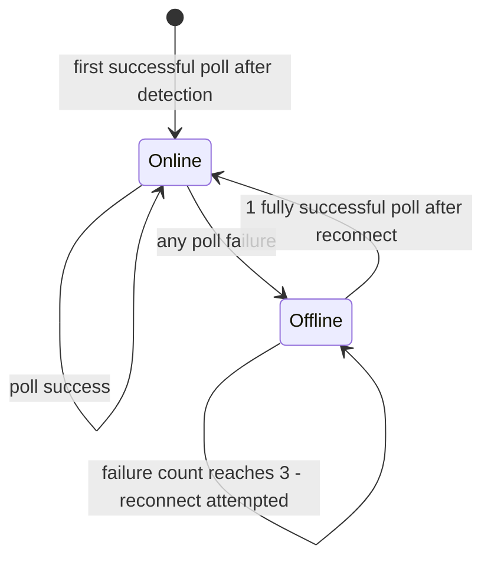

# ESP32 - SerialController

An ESP32 port of the [SerialController](https://github.com/Warpguru/DCDC-Converter) Java application.
The Java application controls DC/DC bench power supplies (Riden RD50xx/RD60xx,
Sinilink XY-series, Wuzhi ZK-series) over Modbus RTU and exposes a REST +
WebSocket API to browser clients. The ESP32 port replicates the same API surface
and behaviour on embedded hardware, replacing:

- the JVM with the ESP32 Arduino / FreeRTOS runtime
- Javalin HTTP+WebSocket with ESPAsyncWebServer (port 80)
- Jackson JSON with ArduinoJson v7
- Java threads with FreeRTOS tasks pinned to specific cores
- `jSerialComm` with direct `Serial2` / UART2 access via a FreeRTOS-queue Modbus task

---

## Supported Devices

| Manufacturer | Model family | Topology |
|---|---|---|
| Sinilink | XY6008 (and variants: XY5008, XY6014, XY6020L, XYH3680, …) | Buck |
| Wuzhi | ZK-6522C (and other ZK-series) | Buck |
| Riden / Ruideng | RD50xx / DPS series | Buck |
| Riden / Ruideng | RD60xx series | Buck |

Device detection is automatic — the ESP32 probes the serial port at startup and selects
the correct driver. See [Device Detection](#device-detection) for the probing order.

---

## Prerequisites

### PlatformIO (automatic via `platformio.ini`)

All dependencies are declared in `lib_deps` and downloaded automatically on first
build. No manual installation required.

### Arduino IDE

Use **Sketch → Include Library → Manage Libraries…** and install:

| Library | Author | Version |
|---|---|---|
| WiFiManager | tzapu | ≥ 2.0.17 |
| ArduinoJson | Benoit Blanchon | ≥ 7.4.3 |
| ESPAsyncWebServer | ESP32Async | ≥ 3.12.1 |
| AsyncTCP | ESP32Async | ≥ 3.5.0 |

> `AsyncTCP` is a required dependency of `ESPAsyncWebServer` — install both.

---

## Hardware Wiring

### Serial2 — Modbus RTU to DC/DC converter

All supported devices expose a **3.3 V TTL UART** header — **not** RS-232 and **not** USB.
The TTL header connects directly to `GPIO 16` (RX2) and `GPIO 17` (TX2) on the
ESP32-WROOM-32. No level shifter is required. GND must be common.
**Do not connect the VCC / +5 V pin** on the device header to the ESP32.

#### Sinilink XY-series (XY5008, XY6008, XY6014, XY6020L, …)

The 4-pin header is on the underside of the control board.

| Device wire colour | Sinilink Signal | ESP32 GPIO |
|---|---|---|
| **Black** | GND | GND |
| **Green** | RxD (device receives) | GPIO 17 — TX2 |
| **Yellow** | TxD (device transmits) | GPIO 16 — RX2 |
| **Red** | +5 V | **NC — do not connect** |

#### Riden RD50xx / DPS series (DPS5005, DPS5010, DPS5020, RD5020, …)

The 4-pin header is accessible through the front-panel cutout or via the rear connector.

| Device wire colour | Riden Signal | ESP32 GPIO |
|---|---|---|
| **Black** | GND | GND |
| **Blue** | RxD (device receives) | GPIO 17 — TX2 |
| **Yellow** | TxD (device transmits) | GPIO 16 — RX2 |
| **Red** | +5 V | **NC — do not connect** |

#### Riden RD60xx series (RD6006, RD6012, RD6018, RD6020, RD6024, RD6030, …)

The 4-pin header is on the back of the display board.

| Device wire colour | Riden Signal | ESP32 GPIO |
|---|---|---|
| **Black** | GND | GND |
| **White** | RxD (device receives) | GPIO 17 — TX2 |
| **Green** | TxD (device transmits) | GPIO 16 — RX2 |
| **Red** | +5 V | **NC — do not connect** |

#### Wuzhi ZK-series (ZK-6522C, …)

The XH2.54-4P 4-pin connector is on the device board.

| Pin | Signal | ESP32 GPIO |
|---|---|---|
| 1 | GND | GND |
| 2 | RxD (device receives) | GPIO 17 — TX2 |
| 3 | TxD (device transmits) | GPIO 16 — RX2 |
| 4 | VCC | **NC — do not connect** |

> **Important (Wuzhi ZK-series):** For Modbus communication the **RX/GND jumper cap
> must be removed** and the board power-cycled. With the jumper in place the device
> operates in analog potentiometer mode and ignores all serial traffic.

> **Note:** Wire colours can vary between manufacturing batches. If in doubt, verify
> with a multimeter: the TxD line idles **high** (~3.3 V) when no data is transmitted.

### Fault indicator

| Signal | ESP32 GPIO |
|---|---|
| Onboard LED — SOS blink on WiFi failure | 2 |

---

## First-time WiFi Setup

On first boot (or after `GET /reset`), the ESP32 starts a captive-portal access
point named **SerialController**. Connect to it from any device and navigate to
`192.168.4.1` to enter your network credentials. The device saves them to NVS
(non-volatile storage) and reconnects automatically on every subsequent boot.

---

## REST API

Base URL: `http://<device-ip>`  
Interactive API reference: [`GET /doc`](http://<device-ip>/doc)

| Method | Endpoint | Request body | Success | Error codes |
|---|---|---|---|---|
| `GET` | `/` | — | `200` Serial Controller live monitor UI | — |
| `GET` | `/doc` | — | `200` REST API reference page | — |
| `GET` | `/api/state` | — | `200` full `ConverterState` JSON | — |
| `GET` | `/api/limits` | — | `200` `LimitsResponse` JSON | — |
| `GET` | `/api/measurements` | — | `200` `{"voltage":…,"current":…,"power":…}` | — |
| `GET` | `/api/voltage` | — | `200` `{"voltage":…}` measured output voltage | — |
| `GET` | `/api/current` | — | `200` `{"current":…}` measured output current | — |
| `GET` | `/api/power` | — | `200` `{"power":…}` measured output power | — |
| `PUT` | `/api/measurements` | `{"voltage":5.0,"current":1.0}` | `204` | `400` out of range · `503` no device |
| `PUT` | `/api/voltage` | `{"voltage": 5.0}` | `204` | `400` out of range · `503` no device · `500` write failure |
| `PUT` | `/api/voltage/verified` | `{"voltage": 5.0}` | `200` `{"voltageSet":5.00}` confirmed | `400` out of range · `409` not accepted · `503` no device |
| `PUT` | `/api/current` | `{"current": 1.0}` | `204` | `400` out of range · `503` no device · `500` write failure |
| `PUT` | `/api/current/verified` | `{"current": 1.0}` | `200` `{"currentSet":1.000}` confirmed | `400` out of range · `409` not accepted · `503` no device |
| `PUT` | `/api/output` | `{"outputEnable": true}` | `204` | `503` no device · `500` write failure |
| `PUT` | `/api/keypad` | `{"keypadLock": true}` | `204` | `503` no device · `500` write failure |
| `POST` | `/api/protection/clear` | — | `204` | `503` no device · `500` write failure |
| `GET` | `/api/log` | — | `200` last 32 log lines as JSON; `?clear=1` to flush | — |
| `PUT` | `/api/log/level` | `{"level":"DEBUG"}` | `200` `{"level":"DEBUG"}` | `400` unknown level |
| `GET` | `/status` | — | `200` ESP32 hardware + WiFi diagnostics JSON | — |
| `GET` | `/reset` | — | `200` clears WiFi credentials and reboots | — |

### `GET /api/state` — ConverterState fields

| JSON field | Type | Description |
|---|---|---|
| `deviceName` | string | Device model, e.g. `"XY6008"` |
| `manufacturer` | string | Manufacturer name |
| `firmwareVersion` | string | Firmware version string |
| `deviceOnline` | boolean | `true` when device communication is healthy |
| `converterTopology` | number | `0` = BUCK, `1` = BOOST, `2` = BUCK_BOOST |
| `voltageOut` | number | Measured output voltage (V) |
| `currentOut` | number | Measured output current (A) |
| `powerOut` | number | Measured output power (W) |
| `voltageIn` | number | Measured input voltage (V) |
| `temperatureCelsius` | number | Device temperature (°C) |
| `voltageSet` | number | Current voltage setpoint (V) |
| `currentSet` | number | Current current setpoint (A) |
| `outputEnabled` | boolean | Output on/off state |
| `keypadLocked` | boolean | Keypad lock state |
| `cvMode` | boolean | `true` = CV mode, `false` = CC mode |
| `protectionState` | number | `0` = normal, non-zero = protection tripped |
| `maxVoltage` | number | Device maximum voltage (V) |
| `minVoltage` | number | Device minimum voltage (V) |
| `maxCurrent` | number | Device maximum current (A) |
| `minCurrent` | number | Device minimum current (A) |
| `maxPower` | number | Device maximum power (W) |
| `configMaxVoltage` | number | Operator voltage cap (V); `0` = no cap |
| `configMaxCurrent` | number | Operator current cap (A); `0` = no cap |

### `GET /api/limits` — LimitsResponse fields

| JSON field | Type | Description |
|---|---|---|
| `manufacturer` | string | Manufacturer name |
| `deviceName` | string | Device model |
| `minVoltage` | number | Minimum voltage setpoint (V) |
| `maxVoltage` | number | Maximum voltage setpoint (V) |
| `minCurrent` | number | Minimum current setpoint (A) |
| `maxCurrent` | number | Maximum current setpoint (A) |
| `maxPower` | number | Maximum power (W) |

---

## WebSocket API

**Endpoint:** `ws://<device-ip>/ws/data`

The ESP32 broadcasts a full `ConverterState` JSON snapshot every second.
Clients may also send sparse JSON command objects.

### Server → client (push, every 1 s)

All fields listed in [`GET /api/state`](#get-apistate--converterstate-fields) are
present in every message — the browser updates only those it needs.

**Setpoint anti-flicker guard:** When the browser sends a `setVoltage` or `setCurrent`
command it sets a local `pendingUntil` timestamp (2 s). Incoming broadcasts do not
update the slider or entry field while that timestamp is in the future, preventing
the transient device read-back from flickering the UI before the new setpoint is confirmed.

### Client → server (commands)

Send a JSON object with one or more of the following keys:

| Key | Type | Description |
|---|---|---|
| `setVoltage` | number | Output voltage setpoint (V) — validated against device limits |
| `setCurrent` | number | Output current setpoint (A) — validated against device limits |
| `setOutput` | boolean | `true` = enable output, `false` = disable |
| `setKeypad` | boolean | `true` = lock keypad, `false` = unlock |

```json
{"setVoltage": 12.0}
{"setCurrent": 2.5}
{"setOutput": true}
{"setKeypad": false}
```

Unknown keys are ignored. Malformed JSON is ignored. Out-of-range setpoints are
rejected server-side; the connection stays open.

---

## Web UI

Open `http://<device-ip>` in a browser after the ESP32 has connected to WiFi.

The single-page UI is the Java reference implementation served from PROGMEM.
It connects via WebSocket and provides:

- **Live telemetry** — output voltage, current, power, and input voltage cards updated every second
- **Output toggle** — enable/disable converter output
- **Keypad lock toggle** — lock/unlock the device front panel
- **Mode / protection panel** — CV/CC mode indicator and protection-tripped status
- **Voltage setpoint** — slider + numeric entry + increment/decrement buttons with press-and-hold auto-repeat
- **Current setpoint** — slider + numeric entry + increment/decrement buttons with press-and-hold auto-repeat
- **Dynamic ceilings** — setpoint controls are automatically capped to `configMaxVoltage` / `configMaxCurrent` when operator limits are configured, and additionally to `voltageIn − 1 V` on BUCK converters
- **Collapsible message log** — records every state change and server command

---

## Architecture

### Source layout

```
SerialController/
├── SerialController.ino          Arduino IDE entry point (stub — delegates to Application)
├── SerialController.cpp          PlatformIO entry point (#ifndef ARDUINO guard)
├── platformio.ini
└── src/
    ├── modbus/src/
    │   ├── ModbusTransport.h/.cpp    Low-level Modbus RTU framing + FreeRTOS queue
    │   ├── ModbusCRC.h/.cpp
    │   ├── ModbusFunctionCodes.h
    │   └── ModbusConstants.h
    ├── device/src/
    │   ├── base/
    │   │   ├── ModbusDevice.h/.cpp   Abstract base — read/write helpers
    │   │   └── DeviceRegister.h/.cpp Register descriptor (address, scale, name)
    │   ├── RidenRegistersRD60xx.h/.cpp  Register address map for RD60xx
    │   ├── RidenRegistersRD50xx.h       Register address map for RD50xx
    │   ├── SinilinkRegisters.h          Register address map for Sinilink XY
    │   └── WuzhiRegisters.h             Register address map for Wuzhi ZK
    ├── devices/src/
    │   ├── ifc/DC2DCConverter.h      Pure abstract interface (all four drivers)
    │   ├── RidenRD60xx.h/.cpp        Riden RD60xx driver
    │   ├── RidenRD50xx.h/.cpp        Riden RD50xx driver
    │   ├── Sinilink.h/.cpp           Sinilink XY-series driver
    │   └── Wuzhi.h/.cpp              Wuzhi ZK-series driver
    ├── service/src/
    │   ├── ConverterState.h/.cpp     Shared state (mutex-protected)
    │   ├── ConverterTopology.h       enum class BUCK / BOOST / BUCK_BOOST
    │   ├── DeviceDetection.h/.cpp    Auto-detection probing loop
    │   ├── DeviceService.h/.cpp      Polling task + validated write operations
    │   ├── RestService.h/.cpp        All /api/* HTTP handlers
    │   └── WebSocketService.h/.cpp   1 s broadcast task + command queue
    └── SerialController/src/
        ├── Application.h/.cpp        applicationSetup() / applicationLoop() — global singletons, wiring
        ├── Server.h/.cpp             WiFiManager, route registration, ESP32-specific endpoints
        ├── index_html.h              PROGMEM wrapper for the browser UI
        ├── LogBuffer.h/.cpp          Levelled ring-buffer logger + GET /api/log
        ├── ActiveDevice.h            extern DC2DCConverter* activeDevice
        ├── ConverterStateGlobal.h    extern ConverterState converterState
        └── ESPInfo.h                 GET /status diagnostics helper
```

### Java → C++ mapping

| Java class | C++ equivalent |
|---|---|
| `ModbusTransport` | `ModbusTransport` — same framing logic; Serial2 I/O runs in a dedicated FreeRTOS task |
| `ModbusDevice` | `ModbusDevice` — same read/write/writeVerified helpers |
| `DeviceRegister` | `DeviceRegister` — same address + scale descriptor |
| `DC2DCConverter` (interface) | `DC2DCConverter` — pure abstract class |
| `RidenRD60xx` / `RidenRD50xx` / `Sinilink` / `Wuzhi` | Same-named concrete drivers |
| `ConverterState` (volatile fields) | `ConverterState` — FreeRTOS mutex-protected (see [Mutex note](#java-volatile-vs-freertos-mutex)) |
| `ConverterTopology` (enum) | `enum class ConverterTopology` |
| `DeviceService` (polling thread) | `DeviceService` — FreeRTOS polling task on Core 1 |
| `WebSocketService` (broadcaster thread) | `WebSocketService` — FreeRTOS broadcast task on Core 1 |
| `RestService` (Javalin routes) | `RestService` — ESPAsyncWebServer handlers |
| `SerialControllerApplication.main` | `Application.cpp` — `applicationSetup()` / `applicationLoop()` |
| Log4j2 / SLF4J | `LogBuffer` — levelled ring-buffer logger; output to UART0 + `GET /api/log` |

---

## Threading Model

```
Core 0                                   Core 1
───────────────────────────────────────  ───────────────────────────────────────
WiFi / lwIP stack (system)               Arduino main task: setup() → loop()
ESPAsyncWebServer request callbacks        applicationSetup() — wiring
modbusTransportTask (priority 2)           applicationLoop() — WS command drain
  └─ sole owner of Serial2              DeviceService pollingTask (priority 2)
       Serial2.read()                   WebSocketService broadcastTask (priority 1)
       Serial2.write()
       Serial2.available()
       Serial2.end() / begin()
```

### Why a dedicated FreeRTOS task for Serial2?

The Java `ModbusTransport` calls `out.write()` / `in.read()` directly on the caller's
thread. In Java, `DeviceService`'s `synchronized` keyword is the only concurrency guard
— it prevents two threads from entering any method at the same time, so serial I/O is
always single-threaded.

On ESP32, `ESPAsyncWebServer` delivers HTTP and WebSocket callbacks on Core 0 alongside
the WiFi/lwIP stack. If Modbus I/O happened directly on those callbacks it could race
with WiFi processing.

The chosen solution is a **single-owner task pattern**:

- `modbusTransportTask` is the **sole** owner of `Serial2`. No other task ever calls
  `Serial2.read()`, `Serial2.write()`, or `Serial2.end()`/`Serial2.begin()`.
- All callers (DeviceService, DeviceDetection) call `transport->readRegister()` /
  `writeRegister()` etc., which enqueue a `ModbusRequest` on `_requestQueue` and block
  until `modbusTransportTask` returns the result via a per-call response queue.
- The queue **is** the synchronisation mechanism — it serialises all Modbus operations
  and guarantees exactly one is in flight at a time, matching the Java `synchronized` guarantee.
- `modbusTransportTask` is pinned to **Core 0** so its `readBytes()` busy-wait loop
  runs in the gaps between WiFi bursts on the same core, without starving Core 1 tasks.
- `setBaud()` and `reconnect()` also route through the queue so that
  `Serial2.end()`/`Serial2.begin()` always executes **inside** `modbusTransportTask`,
  never racing with an in-progress `readBytes()`.

---

## Startup Sequence

```
applicationSetup()
  │
  ├─ Serial.begin(115200)
  ├─ Log.begin()                 initialises ring buffer mutex; output to UART0 + /api/log
  ├─ new ModbusTransport(RX=16, TX=17, 9600)
  │    └─ starts modbusTransportTask on Core 0
  │
  ├─ detectDevice(transport, slave=1)
  │    ├─ Pass 1: probe at 115200, 9600 baud
  │    │    for each baud: Sinilink → Wuzhi → RD50xx → RD60xx
  │    └─ Pass 2 (if needed): probe at 19200, 38400, 57600 baud
  │         returns DC2DCConverter* or nullptr
  │
  ├─ [nullptr → WARN logged, server starts without a device]
  │
  └─ setupServer()
       ├─ WiFiManager.autoConnect("SerialController")
       ├─ [WiFi failure → SOS blink on GPIO 2, halt]
       ├─ new DeviceService(state, activeDevice)
       ├─ RestService.registerRoutes()
       ├─ WebSocketService.begin()       starts broadcastTask on Core 1
       ├─ server.begin()                 starts ESPAsyncWebServer on port 80
       └─ DeviceService.begin()          starts pollingTask on Core 1

applicationLoop()
  └─ drain WebSocket command queue → dispatch to DeviceService
```

---

## Java `volatile` vs FreeRTOS Mutex

The Java source declares all shared `ConverterState` fields as `volatile`:

```java
private volatile double voltageOut;
```

In the C++ port every shared field is protected by a FreeRTOS mutex instead.

### Why `volatile` is sufficient in Java

The Java Memory Model (JLS §17) gives `volatile` two guarantees:

1. **Visibility** — a write is immediately flushed to main memory and visible to all
   threads on the next read.
2. **Atomicity** — a single read or write of any `volatile` field (including `double`
   and `long`) is atomic by specification (JLS §17.7).

### Why `volatile` is not enough on ESP32

The ESP32 is a dual-core Xtensa LX6 processor. Its two cores have **separate L1 data
caches** with no hardware cache-coherency protocol mapping to Java's memory model.
C++ `volatile` means only *"do not optimise this access away"* — it makes no promise
about inter-core visibility or atomicity of 64-bit values.

| Risk | Java | ESP32 C++ |
|---|---|---|
| **Torn 64-bit write** | Impossible — JLS §17.7 | Possible — a `double` write is two 32-bit stores; a task preempted between them produces a half-written value |
| **Stale cache line** | Impossible — `volatile` flushes | Possible — Core 1 may read a value still cached from before Core 0 wrote it |

`xSemaphoreTake` / `xSemaphoreGive` solve both: they serialise access across cores
**and** include the memory-barrier instructions that flush CPU caches.

---

## Serial Console

All log output is transmitted on **UART0** (GPIO 1 TX, 115200 baud). Log lines are
also stored in a 32-entry ring buffer and retrievable via `GET /api/log` without any
USB connection.

To read UART0 output without USB (headless / battery operation):

1. Connect a **3.3 V USB-to-UART adapter** (CP2102, CH340, FT232, etc.).
   **Do not use a 5 V adapter — GPIO 1/3 are not 5 V tolerant.**

| Signal | ESP32 GPIO | Adapter pin |
|---|---|---|
| UART0 TX (log output) | 1 (TX0) | RXD |
| UART0 RX (optional) | 3 (RX0) | TXD |
| GND | GND | GND |

2. Open a terminal at **115200 baud, 8-N-1**.

> While the adapter is connected, do not simultaneously connect USB — the two drivers
> conflict. Disconnect the adapter before uploading firmware.

The active log level defaults to **INFO** and can be changed at runtime via
`PUT /api/log/level {"level":"DEBUG"}`. Valid levels: `ERROR`, `WARN`, `INFO`, `DEBUG`, `TRACE`.

---

## Device Detection

At startup, `detectDevice()` probes the serial port in two passes:

**Pass 1 — primary baud rates:** 115200, 9600  
**Pass 2 — fallback baud rates (if Pass 1 found nothing):** 19200, 38400, 57600

At each baud rate, drivers are tried in this order:

| Step | Driver | Notes |
|---|---|---|
| 1 | Sinilink XY-series | |
| 2 | Wuzhi ZK-series | |
| 3 | Riden RD50xx / DPS | |
| 4 | Riden RD60xx | |

Once a driver responds successfully, detection stops and the matched driver is used
for the entire session. If all probes fail, `ConverterState.deviceOnline` remains
`false` and the server starts anyway — `/api/state`, `/status`, and `/ws/data` remain
reachable for diagnostics.

### Detection timing and the Task Watchdog

`detectDevice()` probes four drivers × up to five baud rates before concluding no
device is present. Each failed probe blocks the calling task for up to
`READ_TIMEOUT_MS` while `modbusTransportTask` waits for a serial response.

`READ_TIMEOUT_MS` is set to **100 ms** — well above the <50 ms actual device response
time, and low enough that a full five-baud scan completes in ~2 seconds. The TWDT
default threshold on Arduino ESP32 is ~5 seconds, so the worst-case scan (3 fallback
baud rates × 4 drivers × 100 ms = 1.2 s) is comfortably within budget.

`esp_task_wdt_reset()` was considered for explicit keepalive at each baud-rate
iteration but caused "task not found" errors at runtime: `applicationSetup()` runs on
the Arduino loop task, which is **not subscribed** to the TWDT by default, so calling
`esp_task_wdt_reset()` on it is an error. Instead, `vTaskDelay(1)` is called once per
baud-rate iteration — this yields one scheduler tick to the FreeRTOS kernel, keeping
the scheduler fed during the blocking scan without requiring any TWDT subscription.

### Online / offline hysteresis

The `deviceOnline` flag in `ConverterState` is not a direct mirror of the last poll result.
Asymmetric thresholds prevent false state changes during transient communication glitches:

- **Any poll failure** → Offline **immediately** (poll failures include timeouts and
  Modbus errors; going Offline is conservative and triggers reconnect on the third
  consecutive failure)
- **3 consecutive failures** → reconnect attempted (`Serial2.end()` / `Serial2.begin()`)
- **1 consecutive fully-successful poll** → back Online (a complete `pollAll()` already
  validates every register in the block; one clean cycle is sufficient confirmation)



---

## Register Scaling

Raw Modbus register values are divided by a scale factor to produce SI units:

| Device | Quantity | Scale | Example |
|---|---|---|---|
| Sinilink XY6008 / XY6014 | Voltage | 100 | `500` raw = 5.00 V |
| Sinilink XY6008 / XY6014 | Current | 1000 | `2500` raw = 2.500 A |
| Sinilink XY6008 / XY6014 | Power | 100 | `123` raw = 1.23 W |
| Sinilink XY6020L / XYH3680 | Voltage | 100 | `500` raw = 5.00 V |
| Sinilink XY6020L / XYH3680 | Current | 100 | `250` raw = 2.50 A |
| Sinilink XY6020L / XYH3680 | Power | 100 | `123` raw = 1.23 W |
| Wuzhi ZK-series | Voltage | 100 | `500` raw = 5.00 V |
| Wuzhi ZK-series | Current | 100 | `2200` raw = 22.00 A |
| Wuzhi ZK-series | Power | 100 | `123` raw = 1.23 W |
| Riden RD50xx / DPS | Voltage | 100 | `500` raw = 5.00 V |
| Riden RD50xx / DPS | Current | 100 | `250` raw = 2.50 A |
| Riden RD50xx / DPS | Power | 100 | `123` raw = 1.23 W |
| Riden RD60xx | Voltage | 100 | `500` raw = 5.00 V |
| Riden RD60xx | Current | 1000 | `2500` raw = 2.500 A |
| Riden RD60xx | Power | 100 | `123` raw = 1.23 W |

---

## Repository

ESP32 port: [github.com/Warpguru/ESP](https://github.com/Warpguru/ESP)  
Java reference implementation: [github.com/Warpguru/DCDC-Converter](https://github.com/Warpguru/DCDC-Converter)
