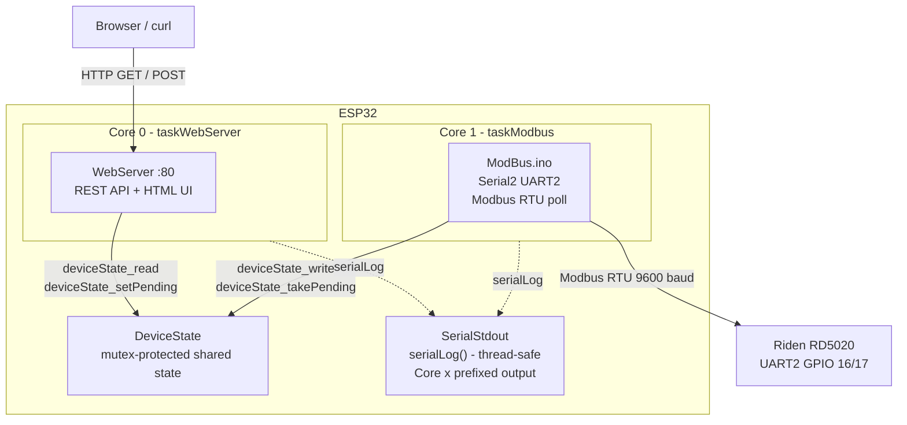
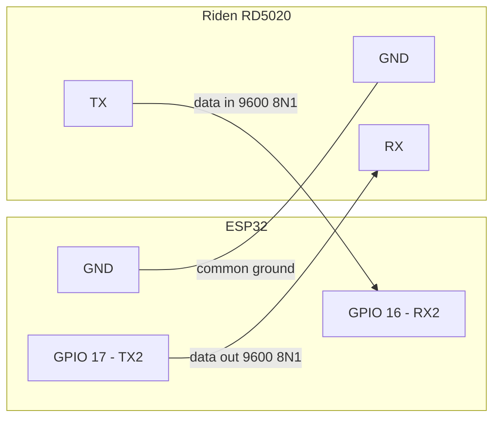

# ESP - SerialController

An ESP32-based controller for the **Riden RD5020 (DPS5020)** DC/DC power supply.
The ESP32 speaks **Modbus RTU** over a hardware UART to the converter and exposes a
**RESTful API** and a **web control panel** over WiFi.

---

## Architecture

| Layer | File(s) | Responsibility |
|---|---|---|
| Main / Tasks | `SerialController.ino` | `setup()`, `loop()`, FreeRTOS task creation, register defines |
| Modbus protocol | `ModBus.ino` | CRC-16, `readModbusRegister()`, `writeModbusRegister()` |
| Shared state | `DeviceState.h` / `DeviceState.ino` | Mutex-protected struct, pending-command pattern |
| Web server & API | `Server.ino` | WiFiManager, HTTP route registration, all request handlers |
| HTML rendering | `HtmlService.ino` | Shared header/footer, control panel page |
| Diagnostics | `DiagnosticsService.ino` | Hardware diagnostics JSON + diagnostics web page |
| Logging | `SerialStdout.ino` | `serialLog()` - thread-safe, `[Core x]` prefixed Serial output |

---

## REST API

| Endpoint | Method | Description |
|---|---|---|
| `GET /` | GET | HTML control panel |
| `GET /api/state` | GET | Full `DeviceState` as JSON |
| `POST /api/voltage?v=12.50` | POST | Set voltage set-point |
| `POST /api/current?i=2.00` | POST | Set current set-point |
| `POST /api/ovp?v=13.00` | POST | Set over-voltage protection |
| `POST /api/ocp?i=3.00` | POST | Set over-current protection |
| `POST /api/output?on=1` | POST | Turn output ON / OFF |
| `POST /api/keylock?lock=1` | POST | Lock / unlock keypad |
| `GET /diagnostics` | GET | HTML diagnostics page |
| `GET /api/diagnostics` | GET | Full hardware diagnostics as JSON |
| `GET /reset` | GET | Clear WiFi credentials and reboot to AP mode |

---

## WiFi Setup

On first boot the ESP32 creates a WiFi access point named **`SerialController`**.
Connect to it and enter your network credentials. They are saved to flash and reused on
every subsequent boot. Call `GET /reset` to clear credentials and return to AP mode.

---

## Hardware Wiring

---

## Development Iterations

| # | File | What it builds |
|---|---|---|
| 1 | `Iteration 1.md` | Dev environment, Hello World |
| 2 | `Iteration 2.md` | Serial port + heartbeat |
| 3 | `Iteration 3.md` | Raw Modbus RTU implementation |
| 4 | `Iteration 4.md` | WiFi + basic REST API |
| 5 | `Iteration 5.md` | WiFiManager + persistent credentials + `/reset` |
| 6 | `Iteration 6.md` | Basic web UI |
| 7 | `Iteration 7.md` | Shared `DeviceState` struct + mutex accessors |
| 8 | `Iteration 8.md` | Full web control panel + complete REST API + `HtmlService` |
| 9 | `Iteration 9.md` | Dual-core split - WebServer on Core 0, Modbus on Core 1 + `SerialStdout` |
| 10 | `Iteration 10.md` | Hardware diagnostics API + diagnostics web page |

---

## Repository

[github.com/Warpguru/ESP](https://github.com/Warpguru/ESP)
