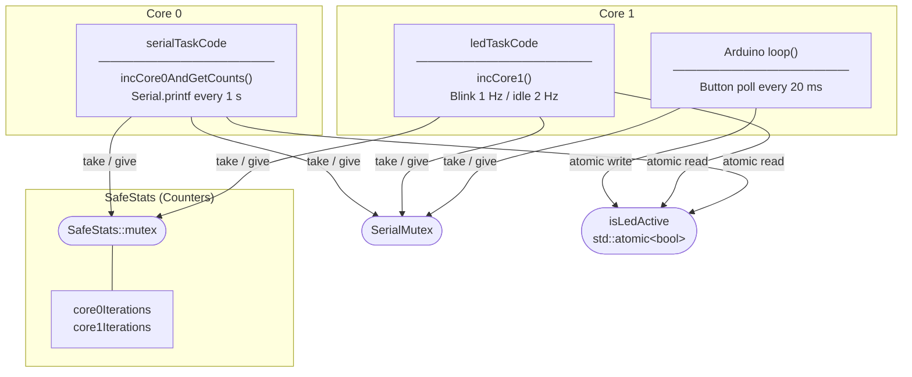

# Threads

## Overview

`Threads.ino` is a proof-of-concept Arduino sketch for the ESP32 that demonstrates safe concurrent programming across both physical CPU cores. Two independent FreeRTOS tasks run simultaneously - one blinks an LED on Core 1, the other prints statistics to the serial console on Core 0 - while a shared counter object is protected by a mutex so that neither task can corrupt the other's data. A physical button (GPIO 0, the built-in BOOT button on most DevKit boards) toggles the LED on and off at runtime, showing how the main Arduino task interacts with the background tasks through a second mutex. The sketch serves as a minimal, self-contained template for the task-isolation pattern that underpins reliable multi-core ESP32 firmware.

## Technical Architecture

The sketch uses two FreeRTOS synchronisation primitives and one C++ class to demonstrate safe concurrency.

**Synchronisation objects**

| Object | Type | Purpose |
|---|---|---|
| `SafeStats::mutex` | `SemaphoreHandle_t` (mutex) | Guards the shared iteration counters inside `SafeStats` |
| `SerialMutex` | `SemaphoreHandle_t` (mutex) | Serialises all `Serial.print` calls so output is never interleaved |
| `isLedActive` | `std::atomic<bool>` | Allows lock-free cross-core signalling for the LED on/off state |

**Hardware wiring**

| Signal | ESP32 pin | Notes |
|---|---|---|
| LED anode | GPIO 21 | Via 220–330 Ω current-limiting resistor to LED cathode → GND |
| Button | GPIO 0 | Built-in BOOT button on most DevKit boards; pulled up internally, active LOW |

```
ESP32 GPIO 21 ──[220Ω]──▶|── GND
               resistor LED
```

**`SafeStats` class**

A C++ class owns the two iteration counters (`core0Iterations`, `core1Iterations`) and their mutex. All access goes through four public methods - `incCore0()`, `incCore1()`, `getCounts()`, and `incCore0AndGetCounts()` - each of which acquires the mutex, performs its operation, and immediately releases it. This encapsulates the locking discipline inside the class so callers cannot accidentally bypass it.

**Task layout**

| Task | Core | Stack | Priority | Behaviour |
|---|---|---|---|---|
| `serialTaskCode` | 0 | 10 000 B | 1 | Increments the Core 0 counter, reads a snapshot of both counters, prints the result, sleeps 1 s |
| `ledTaskCode` | 1 | 10 000 B | 1 | Increments the Core 1 counter, blinks the LED at 1 Hz when active or prints a waiting message at 2 Hz when inactive |
| Arduino `loop` | 1 (shared) | - | - | Polls GPIO 0 for a falling edge and atomically flips `isLedActive` |



**Startup sequence (`setup`)**

1. UART0 is opened at 115200 baud and `SerialMutex` is created. A hard restart is triggered if the mutex allocation fails (heap exhaustion at boot).
2. `serialTaskCode` is pinned to Core 0 via `xTaskCreatePinnedToCore`.
3. A 100 ms delay gives the serial task time to start before the LED task is pinned to Core 1.
4. A confirmation message is printed under `SerialMutex`, after which `setup()` returns and the Arduino runtime enters `loop()`.

**Why `volatile` is not enough**

On a single-core AVR, `volatile` prevents the compiler from caching a variable in a register, which is sufficient for ISR-shared state. On the ESP32's dual-core Xtensa architecture, each core has its own store buffer and cache. A `volatile` write on Core 1 is not guaranteed to be flushed to the shared L2 cache before Core 0 reads the same address. `std::atomic<bool>` inserts the necessary memory barrier instructions, making the cross-core visibility guarantee part of the C++ standard rather than a hardware assumption.

## Thread safety

Your Java and C++ instincts are 100% correct. Thread safety is arguably more critical on the ESP32 because you are dealing with two physical cores (Symmetric Multiprocessing - SMP) and direct hardware access.

Here is the breakdown of how to handle library thread safety on the ESP32:

1. Most Arduino Libraries are NOT Thread-Safe

Most libraries in the Arduino ecosystem were originally written for single-core AVR (Uno/Mega) chips. They often use global variables or static buffers. If you call modbus.read() from Core 0 and modbus.write() from Core 1 at the same time on the same instance, the internal state will likely corrupt, causing a crash or a "Guru Meditation Error."

2. The "Isolation Pattern" (The Pro Way)

Instead of trying to make a library thread-safe, the standard "Pro" architecture is to isolate the library to a single thread.

    * Task A (Core 0): "Owns" the WebServer object. No other thread ever touches it.
    * Task B (Core 1): "Owns" the ModBus object. No other thread ever touches it.
    * Communication: They talk to each other only through a Mutex-protected struct or a FreeRTOS Queue.

This is the pattern used in this sketch: `SafeStats` is the shared data object, owned by neither task directly - both tasks access it only through its mutex-protected methods. In a WebServer/Modbus scenario, the WebServer task would read the stats (while holding the mutex) to display them on a page, while the Modbus task updates them.

3. The "Dangerous" Hardware Resources

On an ESP32, you must be particularly careful with shared hardware buses:
    * I2C / SPI: If you have an OLED on I2C and a Sensor on I2C, and you try to talk to them from different threads, the bus will lock up. You must use a Mutex to wrap the
     transaction.
    * Serial: `Serial.print` from two cores simultaneously results in garbled text, and in rare timing scenarios can corrupt the internal ring buffer and trigger an assertion failure. Always protect serial output with a mutex, as this sketch does.
    * WiFi Stack: The underlying ESP-IDF WiFi driver and lwIP stack are internally synchronised and safe to call from any task. However, the higher-level Arduino `WiFiClient` wrapper maintains its own connection state and buffers that are not thread-safe - treat each `WiFiClient` instance as owned by a single task.

4. FreeRTOS Primitives are your Friends

Since the ESP32 runs FreeRTOS, you have powerful tools that Java developers would recognize:
    * Semaphores/Mutexes: What we used for the stats.
    * Queues: Excellent for passing messages (e.g., the WebServer puts a "Turn on Relay" command into a queue, and the Modbus task picks it up when it's ready).
    * Task Notifications: Lightweight signaling between threads.

## Summary for your Project:

Keep the WebServer and Modbus on separate cores - one task per core, each owning its library exclusively. Core assignment is a matter of preference; the WiFi radio driver and lwIP run their own internal tasks regardless of which core your application tasks use, so there is no technical requirement to pin the WebServer to Core 0 specifically. Use a mutex-protected struct or a FreeRTOS Queue to pass data between the two tasks. This keeps the code simple, prevents library corruption, and ensures that slow Modbus timing does not make the web interface feel laggy.
